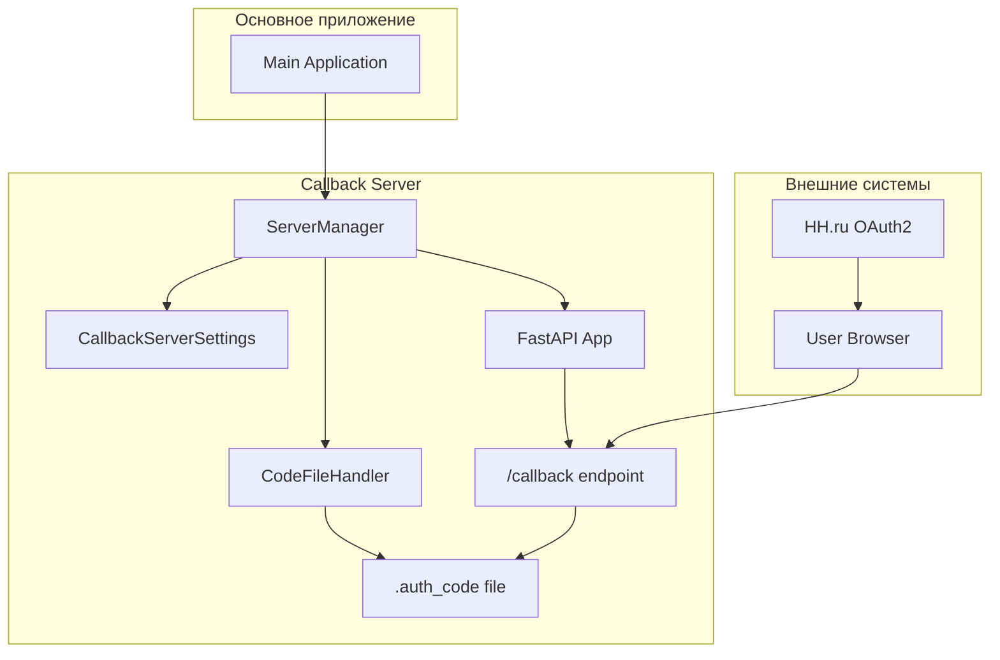
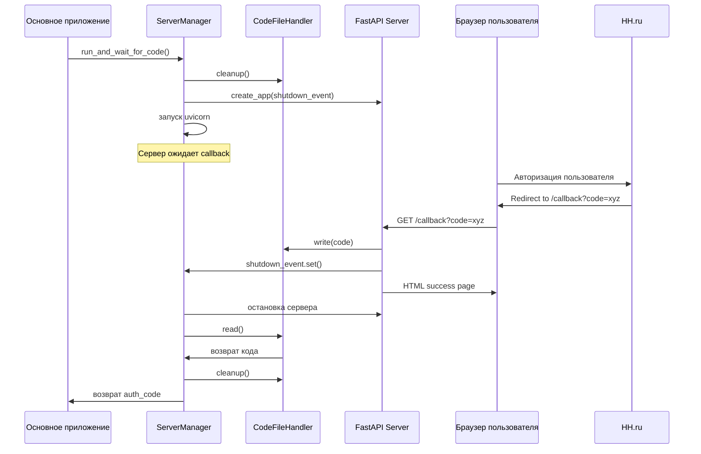

# Компонент Callback Server

## Обзор

Компонент `callback_server` представляет собой временный локальный HTTP-сервер, предназначенный для обработки OAuth2 callback'ов в процессе авторизации. Основная задача — принять код авторизации от внешнего OAuth2 провайдера (HH.ru) и безопасно передать его обратно в основное приложение.

Сервер запускается только на время получения кода авторизации, после чего автоматически завершает работу, что обеспечивает безопасность и минимальное потребление ресурсов.

## Контракт

Публичный интерфейс компонента:

-   `ServerManager`: Основной класс для управления жизненным циклом сервера
-   `CodeFileHandler`: Утилита для работы с временным файлом кода авторизации  
-   `CallbackServerSettings`: Модель настроек сервера на основе Pydantic
-   `create_app()`: Factory-функция для создания FastAPI приложения

## Архитектура

Компонент построен с соблюдением принципов SOLID и использует следующие архитектурные паттерны:

- **Single Responsibility**: каждый класс отвечает за единственную задачу
- **Dependency Injection**: зависимости передаются через конструкторы
- **Event-driven**: координация через `asyncio.Event`
- **Factory Pattern**: создание приложения через фабричную функцию



## Компоненты

### ServerManager (manager.py)

Центральный класс, управляющий полным жизненным циклом сервера.

**Ответственность:**
- Запуск и остановка HTTP-сервера
- Координация между компонентами
- Обработка ошибок и очистка ресурсов

**Основной метод:**
```python
async def run_and_wait_for_code() -> str:
    """Запускает сервер и ожидает получения кода авторизации."""
```

### CodeFileHandler (code_handler.py)

Инкапсулирует логику работы с временным файлом для хранения кода авторизации.

**Ответственность:**
- Запись кода в файл
- Чтение кода из файла
- Очистка временного файла
- Проверка существования файла

**Методы:**
```python
def write(code: str) -> None
def read() -> str  
def cleanup() -> None
def exists() -> bool
```

### CallbackServerSettings (config.py)

Модель настроек с использованием Pydantic для конфигурации сервера.

**Параметры:**
- `host: str = "127.0.0.1"` — хост для привязки сервера
- `port: int = 8080` — порт для прослушивания

**Конфигурация из окружения:**
- Префикс переменных: `CALLBACK_`
- Поддержка `.env` файлов

### FastAPI Application (server.py)

Веб-приложение с единственным эндпоинтом для обработки OAuth2 callback'а.

**Эндпоинт:**
- `GET /callback?code=<auth_code>` — принимает код авторизации

**Логика обработки:**
1. Получение кода из query параметра
2. Сохранение кода через CodeFileHandler
3. Сигнализация о завершении через asyncio.Event
4. Возврат HTML-страницы с подтверждением

## Поток работы



## Особенности реализации

### Безопасность
- Сервер привязывается только к localhost (127.0.0.1)
- Автоматическое завершение после получения кода
- Очистка временных файлов

### Надежность  
- Обработка ошибок на всех уровнях
- Graceful shutdown через asyncio.Event
- Логирование всех операций

### Производительность
- Минимальное время жизни сервера
- Асинхронная архитектура
- Легковесный FastAPI сервер

## Пример использования

```python
from src.callback_server.manager import ServerManager
from src.config import AppSettings

# Инициализация
settings = AppSettings()
server_manager = ServerManager(settings.callback_server)

# Запуск и получение кода
auth_code = await server_manager.run_and_wait_for_code()
print(f"Получен код авторизации: {auth_code}")
```

## Конфигурация

Настройки через переменные окружения:

```bash
CALLBACK_HOST=127.0.0.1
CALLBACK_PORT=8080
```

Или через `.env` файл в корне проекта.

## Демонстрация и Тестирование

### Демонстрационный запуск

Для быстрой демонстрации работы компонента в изоляции, запустите его как исполняемый модуль из корня проекта:

```bash
python -m src.callback_server
```

Сервер запустится, выведет в консоль свой адрес и будет ожидать callback-запроса.

### Юнит-тесты

Автоматические тесты для компонента находятся в директории `tests/callback_server/`.

Они проверяют корректность работы `CodeFileHandler` и другие ключевые аспекты логики. Для запуска тестов выполните команду `pytest` из корня проекта:

```bash
pytest tests/callback_server/
```
