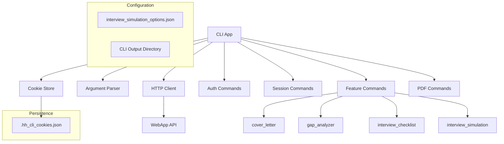

# CLI Component

Консольный интерфейс для взаимодействия с WebApp API. Обеспечивает полный доступ к функционалу системы через командную строку.

## Архитектура



## Основные компоненты

### ApiClient (`src/cli/client.py`)
- **Назначение**: HTTP клиент с персистентными cookies
- **Особенности**: 
  - Автоматическое управление session ID (sid)
  - Таймаут 600 секунд для длительных операций
  - Поддержка нескольких хостов
- **Cookie Store**: Хранение sid в JSON файле по хостам

### CLI App (`src/cli/app.py`) 
- **Назначение**: Основное приложение с парсером команд
- **Команды**:
  - `auth` - аутентификация и управление сессиями
  - `sessions` - загрузка документов и управление сессиями
  - `features` - генерация LLM-фич
  - `pdf` - экспорт результатов в PDF
  - `status` - проверка состояния сервиса

## Использование

### Базовые команды

```bash
# Проверка статуса
python -m src.cli status

# Аутентификация
python -m src.cli auth login

# Загрузка документов
python -m src.cli sessions upload --resume resume.pdf --vacancy-url "https://..."

# Генерация фич
python -m src.cli features run --name gap_analyzer --session-id <id>
```

### Симуляция интервью

```bash
# Стандартная конфигурация
python -m src.cli features run \
  --name interview_simulation \
  --session-id <session-id> \
  --out result.json

# Кастомная конфигурация
python -m src.cli features run \
  --name interview_simulation \
  --session-id <session-id> \
  --options src/cli/configs/interview_simulation_options.json \
  --out simulation_result.json
```

## Конфигурация интервью

Файл `src/cli/configs/interview_simulation_options.json` содержит все настройки для симуляции интервью:

### Основные параметры
- `target_rounds`: Количество раундов диалога (3-7)
- `difficulty_level`: Уровень сложности ("easy"/"medium"/"hard")
- `hr_personality`: Стиль HR ("supportive"/"neutral"/"challenging")

### Типы вопросов
- `include_behavioral`: Поведенческие вопросы (STAR)
- `include_technical`: Технические вопросы
- `include_leadership`: Вопросы на лидерство

### Технические настройки
- `temperature_hr`: Креативность вопросов HR (0.0-1.0)
- `temperature_candidate`: Креативность ответов кандидата (0.0-1.0)  
- `max_tokens_per_message`: Максимум токенов на сообщение

## Персистентность

### Session Cookies
- **Файл**: `.hh_cli_cookies.json` (локальный для каждого пользователя)
- **Структура**: `{"hosts": {"localhost:8080": {"sid": "..."}}}`
- **Назначение**: Автоматический вход без повторной аутентификации

### Выходные файлы
- **Директория**: `src/cli/output/`
- **Типы**: JSON результаты, PDF экспорты
- **Именование**: По timestamp или указанному пути

## Архитектурные решения

### Таймауты
- **CLI аргумент**: `--timeout` (по умолчанию 600с)
- **Клиент**: Настраивается при создании ApiClient
- **Обоснование**: Симуляция интервью требует до 10 минут

### HTTP клиент
- **Библиотека**: httpx (синхронный)
- **Cookies**: Автоматическое управление через httpx.Cookies
- **Redirects**: Включены (follow_redirects=True)

### Обработка ошибок
- **HTTP ошибки**: Пробрасываются с детальной информацией
- **Валидация**: На уровне аргументов и API ответов
- **Timeout**: Информативные сообщения об ошибках

## Интеграция с WebApp

CLI полностью использует существующее WebApp API:
- `/auth/*` - аутентификация
- `/sessions/*` - управление сессиями  
- `/features/*/generate` - генерация LLM-фич
- `/pdf/generate` - экспорт в PDF

## Безопасность

### Cookie файл
- **Права доступа**: Только для владельца (600)
- **Исключения**: Добавлен в .gitignore
- **Ротация**: Автоматическое обновление sid от сервера

### Аутентификация
- **Метод**: Session-based через cookies
- **Персистентность**: Локальное хранение sid
- **Мультихост**: Отдельные сессии для разных серверов

## Расширение

### Добавление новых команд
1. Создать handler функцию в `src/cli/app.py`
2. Добавить subparser в `build_parser()`
3. Зарегистрировать handler через `set_defaults()`

### Новые конфигурации
1. Создать JSON файл в `src/cli/configs/`
2. Добавить комментарии для пользовательских настроек
3. Обновить документацию использования