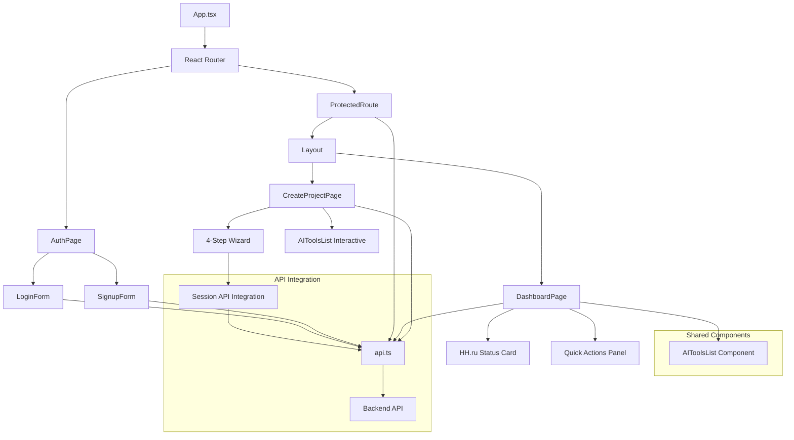

# docs/architecture/components/frontend.md
# --- agent_meta ---
# role: frontend-overview
# owner: @frontend
# contract: обзор React SPA с навигацией к детальной документации
# last_reviewed: 2025-08-29
# interfaces:
#   - Роутинг и основные страницы
#   - Навигация к детальной документации компонентов
# --- /agent_meta ---

# Frontend Overview

## Что есть сейчас
- **3 основные страницы**: аутентификация (`/auth`), дашборд (`/dashboard`) и создание проектов (`/project/create`)
- **Cookie-based авторизация** с HttpOnly cookies и автоматическим редиректом при 401
- **HH.ru интеграция** через OAuth2 с цветовой индикацией статуса
- **Защищенные роуты** с автоматической проверкой сессии через `/me` endpoint
- **Multi-step wizard** для создания проектов с загрузкой PDF и URL вакансий
- **Session-based архитектура** с smart caching для документов

## Роутинг
```
/ или /auth               → AuthPage (LoginForm + SignupForm)
/dashboard                → ProtectedRoute(DashboardPage) - требует авторизации
/project/create           → ProtectedRoute(CreateProjectPage) - wizard создания проектов
/project/:sessionId/tools → ProtectedRoute(AI Tools) - будущая страница AI инструментов
```

## Архитектура


## Компоненты и страницы

### 📄 Страницы
- **[AuthPage](./frontend/pages/auth-page.md)** - вход/регистрация с переключением табов
- **[DashboardPage](./frontend/pages/dashboard-page.md)** - главная после авторизации, HH.ru статус, quick actions
- **[CreateProjectPage](./frontend/pages/create-project-page.md)** - 4-шаговый wizard создания проектов с AI tools

### 🔒 Роутинг и защита
- **[ProtectedRoute](./frontend/pages/protected-route.md)** - обертка для проверки авторизации

### 🎨 Layout и UI
- **[Layout](./frontend/components/layout.md)** - общий каркас с header, navigation, user menu
- **[AIToolsList](./frontend/components/ai-tools-list.md)** - переиспользуемый компонент списка AI инструментов

### 🌐 API и сервисы  
- **[API Client](./frontend/services/api-client.md)** - HTTP клиент, авторизация, HH.ru, session интеграция

## Стек технологий
- **React 18** + **TypeScript** + **Vite**
- **React Router** для навигации
- **Tailwind CSS** для стилизации
- **Lucide React** для иконок
- **Axios** для HTTP запросов

## Быстрый старт
```bash
cd frontend
npm install
npm run dev        # http://localhost:5173
```

## Тесты
Comprehensive тестовое покрытие с Vitest + React Testing Library находится в `tests/` папке.
```bash
npm run test       # запуск тестов
```

Покрытие включает:
- `DashboardPage`: HH status (loading/connected/disconnected), refresh, 409 handling
- `CreateProjectPage`: 4‑шаговый wizard, валидации, FormData, спиннеры, ошибки HH connect
- `AIToolsList`: preview/interactive и onToolClick
