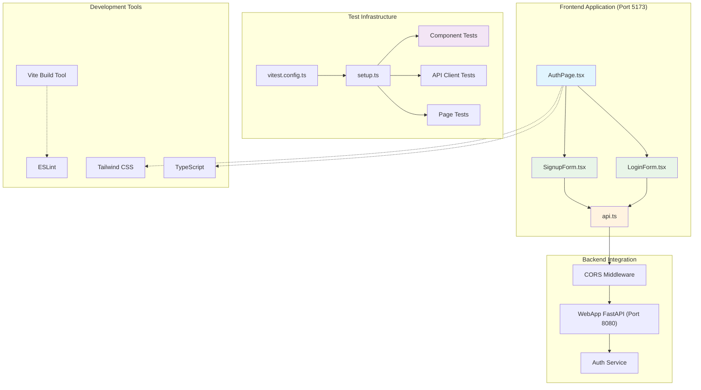

# docs/architecture/components/frontend.md
# --- agent_meta ---
# role: frontend-documentation
# owner: @frontend
# contract: документация React+TypeScript frontend приложения с авторизацией
# last_reviewed: 2025-08-28
# interfaces:
#   - React компоненты для аутентификации (LoginForm, SignupForm, AuthPage)
#   - API клиент для взаимодействия с backend
#   - Comprehensive test suite (Vitest + React Testing Library)
# --- /agent_meta ---

# Frontend Component

## Обзор

Frontend представляет собой современное React+TypeScript веб-приложение, которое предоставляет пользовательский интерфейс для аутентификации и взаимодействия с системой. Использует современный stack технологий: Vite для сборки, Tailwind CSS для стилизации, и comprehensive тестовое покрытие на базе Vitest и React Testing Library.

## Архитектура



## Компоненты

### 1. AuthPage (главная страница)

**Файл**: `src/pages/AuthPage.tsx`

Главная страница приложения с переключением между формами входа и регистрации.

**Функционал:**
- Табовая навигация между "Вход" и "Регистрация"
- Responsive дизайн с Tailwind CSS
- Централизованное управление состоянием форм
- Обработка успешной аутентификации с перенаправлением

**Интерфейс:**
```typescript
// Внутреннее состояние компонента
type AuthTab = 'login' | 'signup'

// Обработчики событий
const handleLoginSuccess = () => void
const handleSignupSuccess = () => void
```

### 2. LoginForm (форма входа)

**Файл**: `src/components/auth/LoginForm.tsx`

Форма входа пользователя с email и паролем.

**Функционал:**
- HTML5 валидация (required, email type)
- Управление состоянием загрузки
- Обработка ошибок с локализованными сообщениями
- Автоочистка ошибок при начале ввода

**Интерфейс:**
```typescript
interface LoginFormProps {
  onSuccess: () => void;
}

interface LoginRequest {
  email: string;
  password: string;
}
```

**Обработка ошибок:**
- 401/Unauthorized → "Неверный email или пароль"
- 404 → "Пользователь не найден"
- Network errors → "Ошибка сети. Проверьте подключение к интернету"
- Прочие ошибки → Исходное сообщение или "Произошла неожиданная ошибка"

### 3. SignupForm (форма регистрации)

**Файл**: `src/components/auth/SignupForm.tsx`

Форма регистрации нового пользователя.

**Функционал:**
- Поля: email, password, org_name (название организации)
- HTML5 валидация с минимальной длиной пароля (6 символов)
- Идентичная обработка ошибок и состояний как в LoginForm
- Автоочистка ошибок при вводе

**Интерфейс:**
```typescript
interface SignupFormProps {
  onSuccess: () => void;
}

interface SignupRequest {
  email: string;
  password: string;
  org_name: string;
}
```

### 4. API Client

**Файл**: `src/lib/api.ts`

Централизованный HTTP клиент для взаимодействия с backend API.

**Возможности:**
- Axios-based HTTP client с настроенным baseURL
- Cookie-based session управление (`withCredentials: true`)
- Автоматическая обработка 401 ошибок с редиректом
- Unified error handling с детальными сообщениями

**Интерфейс:**
```typescript
class ApiClient {
  // Методы авторизации
  async login(credentials: LoginRequest): Promise<AuthResponse>
  async signup(data: SignupRequest): Promise<AuthResponse>
  async logout(): Promise<void>
  
  // Пользователь и статус
  async getCurrentUser(): Promise<User>
  async getHHStatus(): Promise<{ connected: boolean }>
  async checkHealth(): Promise<boolean>
  
  // HH.ru интеграция
  connectToHH(): void
  
  // Приватные методы
  private handleError(error: any): Error
}

export const apiClient = new ApiClient()
```

**Response Interceptor:**
```typescript
// Автоматический редирект на /auth при 401 (если не на странице авторизации)
this.client.interceptors.response.use(
  (response) => response,
  (error: AxiosError) => {
    if (error.response?.status === 401) {
      const currentPath = window.location.pathname;
      if (currentPath !== '/' && currentPath !== '/auth') {
        window.location.href = '/auth';
      }
    }
    return Promise.reject(error);
  }
)
```

## Тестовое покрытие

### Стек тестирования
- **Vitest**: Быстрый test runner совместимый с Vite
- **React Testing Library**: User-centric тестирование React компонентов  
- **jsdom**: Симуляция браузерного окружения в Node.js
- **@testing-library/user-event**: Симуляция пользовательских действий
- **@testing-library/jest-dom**: Дополнительные матчеры для DOM

### Структура тестов

```
tests/
├── components/auth/
│   ├── LoginForm.test.tsx      # Unit тесты формы входа
│   └── SignupForm.test.tsx     # Unit тесты формы регистрации
├── lib/
│   └── api.test.ts             # Unit тесты API клиента
├── pages/
│   └── AuthPage.test.tsx       # Интеграционные тесты страницы
└── README.md                   # Документация тестов
```

### Покрытие тестами

**LoginForm (9 тестов):**
- Рендеринг всех полей формы
- Обновление значений при вводе пользователя
- HTML5 валидация (пустые поля, невалидный email)
- Успешная отправка с валидными данными
- Показ loading state во время запроса
- Обработка ошибок сервера
- Автоочистка ошибок при начале ввода
- Тестирование без client-side валидации пароля

**SignupForm (9 тестов):**
- Аналогичное покрытие как LoginForm
- Дополнительно тестирование HTML5 minlength валидации для пароля
- Тестирование поля org_name без client-side валидации длины

**API Client (7 тестов):**
- Моки axios для изоляции тестов
- Тестирование всех основных методов (login, signup, getCurrentUser, getHHStatus)
- Обработка различных типов ошибок (network, 401, validation errors)
- Тестирование error handling в различных форматах backend ответов

**AuthPage (5 тестов):**
- Рендеринг табовой навигации
- Переключение между формами входа и регистрации
- Интеграционное тестирование потока аутентификации
- Проверка активных состояний табов

### Мокирование

**API Мокирование:**
```typescript
// Полная замена axios для изоляции тестов
vi.mock('axios', () => {
  const mockAxiosInstance = {
    post: vi.fn(),
    get: vi.fn(), 
    defaults: { baseURL: 'http://localhost:8080' },
    interceptors: {
      response: { use: vi.fn() }
    }
  }
  
  return {
    default: { create: vi.fn(() => mockAxiosInstance) }
  }
})
```

**Component Мокирование:**
```typescript
// Мокирование API клиента для компонентных тестов
vi.mock('../../../src/lib/api', () => ({
  apiClient: {
    login: vi.fn(),
    signup: vi.fn()
  }
}))
```

## Технические детали

### Build Configuration

**Vite Configuration** (`vite.config.ts`):
```typescript
export default defineConfig({
  plugins: [react()],
  server: {
    port: 5173,
    host: true
  }
})
```

**Vitest Configuration** (`vitest.config.ts`):
```typescript
export default defineConfig({
  plugins: [react()],
  test: {
    globals: true,
    environment: 'jsdom',
    setupFiles: './src/test/setup.ts',
  },
})
```

### TypeScript Configuration

Строгая конфигурация TypeScript с поддержкой современных возможностей:
- `target: "ES2020"`
- `strict: true`
- Поддержка JSX и React types
- Path mapping для абсолютных импортов

### Styling

**Tailwind CSS Configuration** (`tailwind.config.js`):
```javascript
export default {
  content: [
    "./index.html",
    "./src/**/*.{js,ts,jsx,tsx}",
  ],
  theme: {
    extend: {},
  },
  plugins: [],
}
```

**Используемые классы:**
- Form layouts: `space-y-6`, `block w-full`
- Colors: `indigo-600`, `red-50`, `gray-700`
- Interactive states: `hover:`, `focus:`, `disabled:`
- Responsive design: адаптивность заложена в базовых классах

## Интеграция с Backend

### CORS Configuration

Frontend настроен на работу с backend по адресу `http://localhost:8080`. Backend должен иметь соответствующие CORS настройки:

```python
# В WebApp должен быть настроен CORS
from fastapi.middleware.cors import CORSMiddleware

app.add_middleware(
    CORSMiddleware,
    allow_origins=["http://localhost:5173"],  # Frontend URL
    allow_credentials=True,  # Для cookie-based auth
    allow_methods=["*"],
    allow_headers=["*"],
)
```

### Session Management

Аутентификация основана на HTTP-only cookies с session ID:
- Backend устанавливает `sid` cookie при успешном login/signup
- Frontend автоматически отправляет cookies с каждым запросом (`withCredentials: true`)
- При 401 ошибке происходит автоматический редирект на страницу авторизации

### API Endpoints Integration

Frontend взаимодействует со следующими backend endpoints:
- `POST /auth/login` - вход пользователя
- `POST /auth/signup` - регистрация пользователя  
- `POST /auth/logout` - выход пользователя
- `GET /me` - получение информации о текущем пользователе
- `GET /auth/hh/status` - статус подключения HH.ru
- `GET /auth/hh/connect` - инициация подключения HH.ru
- `GET /healthz` - проверка состояния API

## Development Workflow

### Запуск в разработке
```bash
cd frontend
npm install
npm run dev  # Запускается на http://localhost:5173
```

### Тестирование
```bash
npm run test        # Интерактивный режим
npm run test:run    # Одноразовый запуск всех тестов
npm run test:quick  # Быстрый запуск с минимальным выводом
```

### Production Build
```bash
npm run build       # Сборка в dist/
npm run preview     # Предпросмотр production build
```

### Linting & Type Checking
```bash
npm run lint        # ESLint проверка
npm run tsc         # TypeScript проверка типов
```

## Будущие расширения

Архитектура Frontend подготовлена для следующих расширений:

1. **Dashboard компоненты** для LLM Features
2. **Routing** с React Router для множественных страниц
3. **State Management** (Redux Toolkit/Zustand) для сложного состояния
4. **UI Component Library** для переиспользуемых компонентов
5. **HH.ru Integration UI** для управления подключенными аккаунтами
6. **File Upload Components** для резюме и документов
7. **Results Visualization** для отображения LLM анализов

Текущая архитектура с четким разделением на компоненты, централизованным API клиентом и comprehensive тестовым покрытием обеспечивает solid foundation для этих расширений.