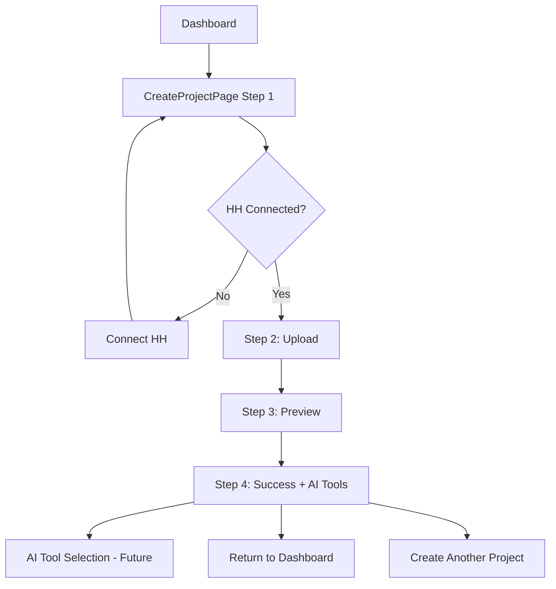

# CreateProjectPage

**Файл**: `src/pages/CreateProjectPage.tsx`

## Что делает

Мульти-шаговый wizard для создания новых проектов (сессий). Проводит пользователя через процесс загрузки PDF резюме и URL вакансии, создает сессию через backend API и предоставляет доступ к AI инструментам.

## Архитектура Wizard

### 4-шаговый процесс:

1. **Step 1: HH Connection Check**
   - Проверка статуса подключения HH.ru через `GET /auth/hh/status`
   - Кнопка подключения если HH не подключен
   - Автоматический переход к Step 2 при успешном подключении

2. **Step 2: Document Upload**
   - PDF upload с drag & drop + file picker
   - URL вакансии с real-time валидацией (регексп `hh\.ru\/vacancy\/\d+`)
   - Preview загруженных документов
   - Валидация: PDF файл + корректный HH URL

3. **Step 3: Processing Confirmation**
   - Preview документов перед отправкой
   - Кнопка "Создать проект" → `POST /sessions/init_upload`
   - Loading индикатор во время LLM парсинга (~1 минута)

4. **Step 4: Success + AI Tools Selection**
   - Информация о созданной сессии (resume title, vacancy, company)
   - Статус кэширования с иконками ♻️ 
   - **Интерактивные кнопки AI инструментов**
   - Навигация: "Создать другой проект" / "На главную"

## Key Features

### Smart Caching Display
```typescript
{wizardState.session.reused.resume && (
  <div className="text-xs text-green-600 mt-2">
    ♻️ Резюме загружено из кэша
  </div>
)}
```

### Multi-step State Management
```typescript
interface WizardState {
  currentStep: number        // 1-4
  resumeFile: File | null
  vacancyUrl: string
  isLoading: boolean
  error: string | null
  session: SessionInitResponse | null
}
```

### Real-time Validation
```typescript
const validateVacancyUrl = (url: string): boolean => {
  const hhUrlRegex = /hh\.ru\/vacancy\/\d+/
  return hhUrlRegex.test(url)
}
```

## API Integration

### Session Creation Flow
```typescript
const formData = new FormData()
formData.append('resume_file', wizardState.resumeFile)
formData.append('vacancy_url', wizardState.vacancyUrl)
formData.append('reuse_by_hash', 'true')

const session = await apiClient.initSession(formData)
// -> SessionInitResponse с session_id, resume, vacancy, reused status
```

### Endpoints используемые:
- `GET /auth/hh/status` - проверка HH подключения
- `GET /auth/hh/connect` - подключение к HH (если нужно)
- `POST /sessions/init_upload` - создание сессии с документами

## AI Tools Integration

### AIToolsList Component
Переиспользуемый компонент из `src/components/ai/AIToolsList.tsx`:
- **Preview mode** (`showAsButtons={false}`) - для Dashboard
- **Interactive mode** (`showAsButtons={true}`) - для CreateProjectPage Step 4

### Available AI Tools
- 📄 **Cover Letter** - генерация сопроводительных писем
- 📊 **Gap Analyzer** - анализ соответствия резюме/вакансии  
- 📋 **Interview Checklist** - подготовка к собеседованию
- 👥 **Interview Simulation** - симуляция интервью

## UX Design Principles

### Progressive Disclosure
Каждый шаг показывает только релевантную информацию, снижая cognitive load

### Clear Visual Feedback
- Progress indicator с шагами 1-4
- Цветовые индикаторы (зеленый = готово, красный = ошибка)
- Loading состояния с анимацией

### Error Resilience
- Client-side валидация в реальном времени
- Server-side error handling с понятными сообщениями
- Возможность вернуться на предыдущие шаги

## Performance Optimizations

### Caching Benefits
- **First time**: PDF → LLM parsing (~1 минута)
- **Repeat**: Same PDF + URL → instant load из кэша
- Visual feedback: ♻️ иконки показывают что загружено из кэша

### Smart Validation
- URL валидация на клиенте - мгновенная обратная связь
- File type validation - предотвращение неправильных загрузок

## Navigation Flow



## Где найти код
- **Страница**: `frontend/src/pages/CreateProjectPage.tsx`
- **AI Tools Component**: `frontend/src/components/ai/AIToolsList.tsx`
- **API Integration**: `frontend/src/lib/api.ts` (initSession method)
- **Types**: `frontend/src/types/api.ts`