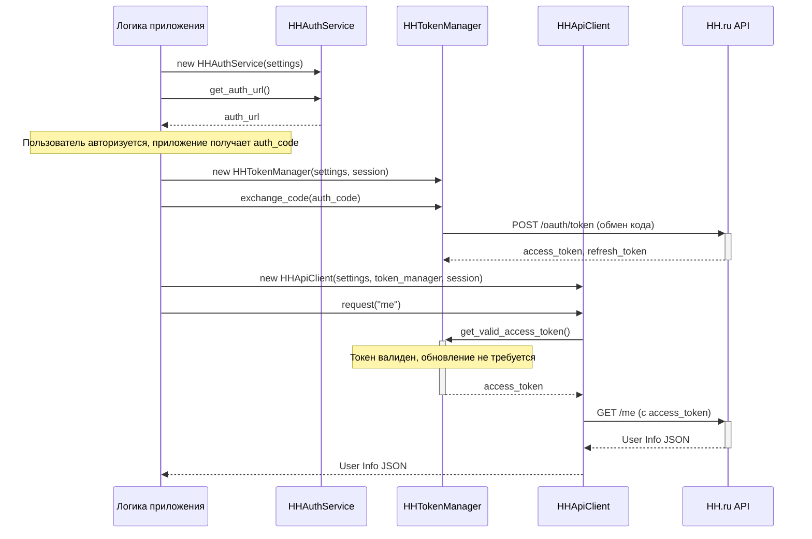

# Компонент: HH Adapter

## 1. Обзор

`HH Adapter` — это самодостаточный компонент, который инкапсулирует всю логику взаимодействия с API HeadHunter. Он отвечает за:
-   Формирование URL для OAuth2 авторизации.
-   Управление жизненным циклом токенов (обмен кода на токен, хранение, автоматическое обновление).
-   Выполнение аутентифицированных запросов к защищенным эндпоинтам API.

Компонент спроектирован так, чтобы быть независимым от бизнес-логики приложения. Оркестрация процесса авторизации (например, запуск `callback_server` и открытие браузера) является задачей вызывающего кода (основного приложения), а не самого адаптера. `HH Adapter` лишь предоставляет необходимые для этого инструменты.

## 2. Архитектура и Зависимости

Компонент построен на принципах **Dependency Injection** и **Single Responsibility**. Каждый класс имеет четкую зону ответственности, а зависимости (настройки, HTTP-сессия) передаются через конструктор.



## 3. Контракт и Классы

Публичный контракт компонента (`src/hh_adapter/__init__.py`) состоит из следующих классов:

-   `HHSettings`: Модель Pydantic для загрузки конфигурации из переменных окружения.
-   `HHAuthService`: Генерирует URL для инициации OAuth2 авторизации.
-   `HHTokenManager`: Управляет полным жизненным циклом токенов.
-   `HHApiClient`: Выполняет аутентифицированные запросы к API.

## 4. Конфигурация

Для работы компонента необходимо определить следующие переменные окружения в `.env` файле:

-   `HH_CLIENT_ID`: Идентификатор вашего OAuth2 приложения в HH.ru.
-   `HH_CLIENT_SECRET`: Секретный ключ вашего OAuth2 приложения.
-   `HH_REDIRECT_URI`: URL, на который HH.ru перенаправит пользователя после авторизации (например, `http://localhost:8080/callback`).

## 5. Пример использования

Ниже приведен полный сценарий использования компонента для получения информации о пользователе.

```python
import asyncio
import aiohttp
from src.hh_adapter import HHAuthService, HHTokenManager, HHApiClient
from src.hh_adapter.config import HHSettings

async def main():
    # 1. Инициализация настроек и сессии
    settings = HHSettings()
    async with aiohttp.ClientSession() as session:
        
        # 2. Получение URL для авторизации
        auth_service = HHAuthService(settings)
        auth_url = auth_service.get_auth_url()
        print(f"Перейдите по ссылке для авторизации: {auth_url}")

        # 3. Получение кода авторизации (этот шаг выполняется вручную или через callback-server)
        # Предположим, что callback-server запущен и вернул нам код.
        auth_code = input("Введите код авторизации, полученный после редиректа: ")

        # 4. Обмен кода на токены
        token_manager = HHTokenManager(settings, session)
        await token_manager.exchange_code(auth_code)
        print("Токены успешно получены.")

        # 5. Выполнение запроса к API
        api_client = HHApiClient(settings, token_manager, session)
        user_info = await api_client.request("me")
        
        print("\nИнформация о пользователе:")
        print(f"  Имя: {user_info.get('first_name')}")
        print(f"  Фамилия: {user_info.get('last_name')}")
        print(f"  Email: {user_info.get('email')}")

if __name__ == "__main__":
    asyncio.run(main())
```

## 6. Демонстрация и Тестирование

### Демонстрационный запуск

Для быстрой демонстрации основной функции компонента (генерации URL для авторизации), запустите его как исполняемый модуль из корня проекта:

```bash
python -m src.hh_adapter
```

Скрипт выведет в консоль готовую ссылку для начала OAuth2-авторизации.

### Юнит-тесты

Автоматические тесты для компонента находятся в директории `tests/hh_adapter/`.

Они проверяют ключевую логику `HHTokenManager` (обработку жизненного цикла токенов) в изоляции от сети с помощью моков. Для запуска тестов выполните команду `pytest` из корня проекта:

```bash
pytest tests/hh_adapter/
```

## 7. Интеграция и DI (Dependency Injection)

В текущей архитектуре компонент `hh_adapter` используется в основном сервисом `Auth` (`src/auth/hh_service.py`) для управления OAuth2-интеграцией.

Важно отметить, что `Auth` сервис активно использует **Dependency Injection** для предоставления зависимостей в `hh_adapter`. Например, `HHTokenManager` и `aiohttp.ClientSession` инъецируются в `HHAccountService`, что позволяет легко подменять их в тестах на моки.

Это улучшает тестируемость слоя `Auth`, при этом **публичный контракт самого `hh_adapter` остается неизменным** и самодостаточным.
