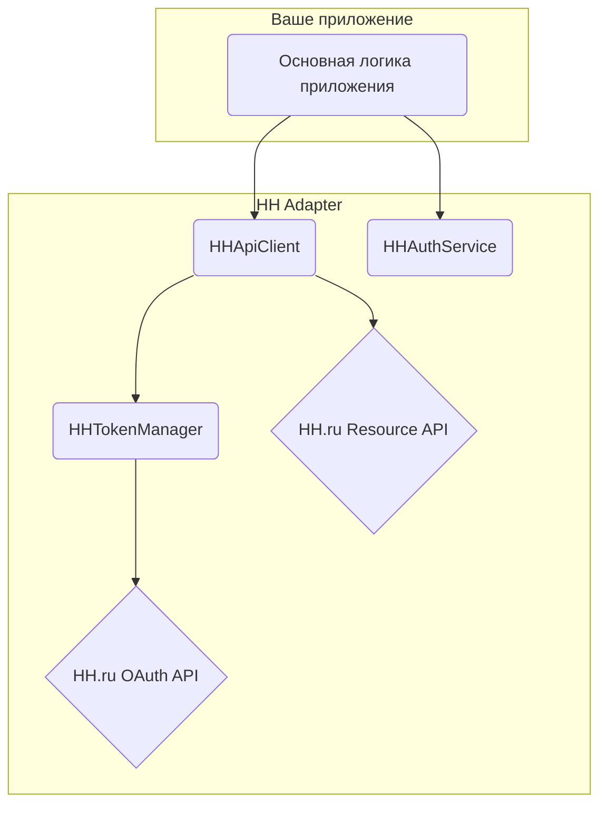

# Компонент HH Adapter

## Обзор

HH Adapter отвечает за все взаимодействия с внешним API HH.ru, включая аутентификацию, управление токенами и получение данных.

Для инициации OAuth2 потока этот компонент полагается на отдельный модуль `callback_server`, который отвечает за получение кода авторизации (`code`) от пользователя. После получения кода `HHTokenManager` использует его для получения необходимых API токенов.

## Контракт

Публичный контракт этого компонента определен в `src/hh_adapter/__init__.py`. Он состоит из нескольких ключевых классов:

-   `HHAuthService`: Предоставляет URL для авторизации пользователя.
-   `HHTokenManager`: Управляет полным жизненным циклом API токенов (запрос, хранение и обновление).
-   `HHApiClient`: Клиент для выполнения аутентифицированных запросов к API HH.ru.
-   `HHSettings`: Настройки компонента на основе Pydantic.

## Архитектура

Адаптер спроектирован с соблюдением принципа Dependency Injection. Основные компоненты, такие как `HHSettings` и `aiohttp.ClientSession`, передаются в конструкторы сервисов, которые в них нуждаются, что способствует слабой связанности и тестируемости.

