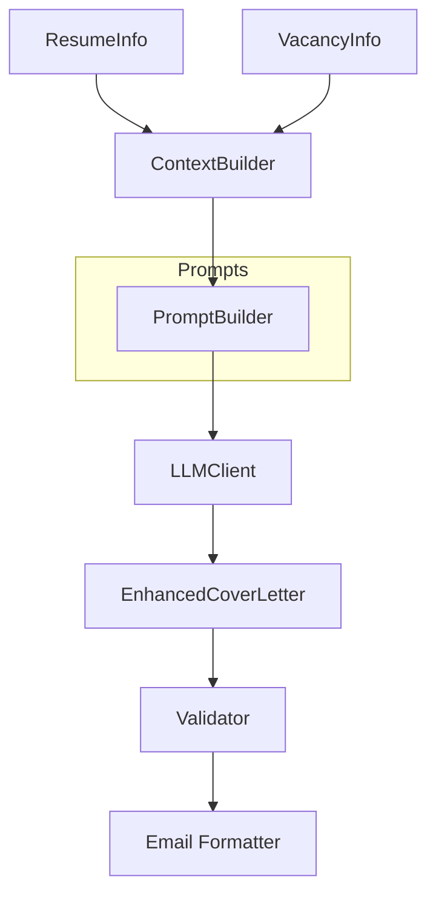
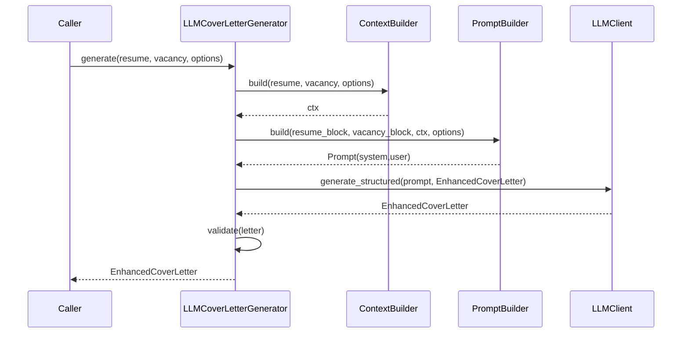

# Компонент: LLM Cover Letter

## Обзор

`llm_cover_letter` — первая фича в новой модульной архитектуре `llm_features`. Библиотечный модуль для генерации персонализированных сопроводительных писем на основе `ResumeInfo` и `VacancyInfo`. 

**Ключевые изменения в новой архитектуре:**
- Наследуется от `AbstractLLMGenerator` из базового фреймворка
- Автоматически регистрируется в `FeatureRegistry` при импорте
- Доступна через унифицированное API: `POST /features/cover_letter/generate`
- Поддерживает версионирование промптов (v1, v2) и префиксную конфигурацию

Компонент реализует contract-first подход, поддерживает версионирование промптов и легко расширяется через DI (билдеры контекста/промптов, валидатор качества, LLM‑клиент).

## Контракт

- `ILetterGenerator`:
  - `async generate(resume: ResumeInfo, vacancy: VacancyInfo, options: CoverLetterOptions) -> EnhancedCoverLetter`
  - `format_for_email(letter: EnhancedCoverLetter) -> str`
- `CoverLetterOptions`: язык, длина, температура, `prompt_version`, `role_hint`, `quality_checks`, `extra_context`.
- Модели: `EnhancedCoverLetter`, `RoleType`, `CompanyContext`, `SkillsMatchAnalysis`, `PersonalizationStrategy`.
- Исключения: `CoverLetterError`, `QualityValidationError`, `PromptBuildError`.

## Архитектура



- `prompts/templates.py`: версии шаблонов (`cover_letter.v1`).
- `prompts/builders.py`: `IContextBuilder`/`IPromptBuilder` + `Default*` реализации.
- `service.py`: `LLMCoverLetterGenerator` (DI: LLM, билдеры, настройки, валидатор).
- `validators.py`: `ICoverLetterValidator` + `DefaultCoverLetterValidator`.
- `formatter.py`: форматирование блоков резюме/вакансии и итогового письма.

## Поток



## Настройки

`LLMCoverLetterSettings` (env префикс `COVER_LETTER_`):
- `PROMPT_VERSION` (default `cover_letter.v1`)
- `TEMPERATURE` (default `0.4`)
- `QUALITY_CHECKS` (default `true`)
- `LANGUAGE` (default `ru`)
- `MODEL_NAME` (опц.)

Используются также `OPENAI_API_KEY`/`OPENAI_MODEL_NAME` для LLM при использовании дефолтной реализации.

## Пример использования

```python
from src.llm_cover_letter import LLMCoverLetterGenerator, CoverLetterOptions, RoleType

# resume: ResumeInfo, vacancy: VacancyInfo (см. examples/parse_parsers.py)
gen = LLMCoverLetterGenerator()
letter = await gen.generate(resume, vacancy, CoverLetterOptions(role_hint=RoleType.DEVELOPER))
print(gen.format_for_email(letter))
```

CLI‑демо:

```bash
# Генерация cover letter
python examples/generate_cover_letter.py --fake-llm

# Генерация с сохранением результата для PDF тестирования
python examples/generate_cover_letter.py --fake-llm --save-result

# Тестирование PDF экспорта
python examples/test_pdf_export.py --feature cover_letter
```

## PDF Export

Cover Letter поддерживает экспорт результатов в профессиональный PDF отчет через модуль `pdf_export`:

### Возможности PDF экспорта:

- **Профессиональное оформление**: структурированное письмо с четкими секциями
- **Полная информация**: мета-данные, анализ навыков, стратегия персонализации
- **Структурированный текст**: разбивка письма на логические части (приветствие, основная часть, заключение)
- **Оценки качества**: визуализация баллов по персонализации, тону, релевантности
- **Рекомендации**: конкретные предложения по улучшению письма

### Использование:

```bash
# Через WebApp API
curl -X POST http://localhost:8080/features/cover_letter/export/pdf \
  -H "Content-Type: application/json" \
  -d '{
    "result": {/* результат Cover Letter */},
    "metadata": {"version": "v1", "language": "ru"}
  }' \
  --output cover_letter_report.pdf

# Через CLI пример
python examples/test_pdf_export.py --feature cover_letter
```

### Структура PDF отчета:

1. **Мета-информация**: дата генерации, тип роли, информация о компании
2. **Анализ соответствия навыков**: подходящие навыки, релевантный опыт, достижения
3. **Стратегия персонализации**: подход к компании, мотивация, ценностное предложение
4. **Структура письма**: полный текст с разбивкой по секциям
5. **Оценки качества**: прогресс-бары для визуализации баллов
6. **Рекомендации по улучшению**: конкретные предложения для повышения эффективности

### Полезные функции:

- **Копирование текста**: полный текст письма доступен для копирования из PDF
- **Секционирование**: каждая часть письма выделена отдельно для анализа
- **Цветовая индикация**: разные типы информации выделены цветом
- **Адаптивный дизайн**: оптимизировано для печати и просмотра

## Расширение

- Замените `IContextBuilder`/`IPromptBuilder` для иной логики промптов.
- Добавьте новые версии шаблонов в `prompts/templates.py` и переключайте `COVER_LETTER_PROMPT_VERSION`.
- Подмените валидатор качества `ICoverLetterValidator` для бизнес‑правил.
