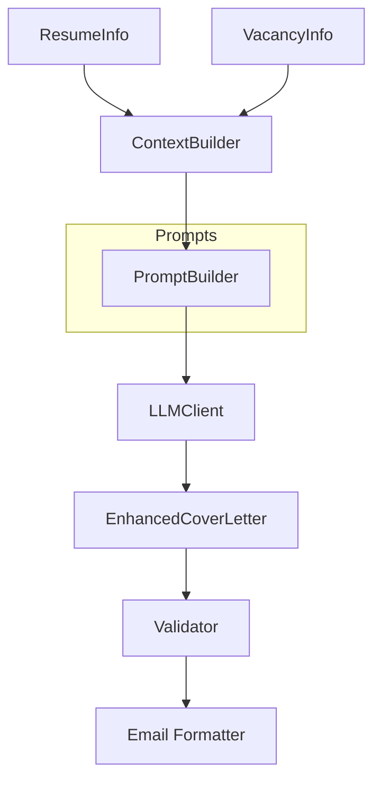
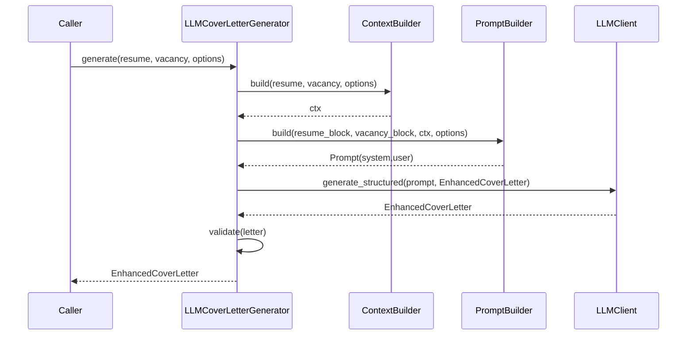

# Компонент: LLM Cover Letter

## Обзор

`llm_cover_letter` — первая фича в новой модульной архитектуре `llm_features`. Библиотечный модуль для генерации персонализированных сопроводительных писем на основе `ResumeInfo` и `VacancyInfo`. 

**Ключевые изменения в новой архитектуре:**
- Наследуется от `AbstractLLMGenerator` из базового фреймворка
- Автоматически регистрируется в `FeatureRegistry` при импорте
- Доступна через унифицированное API: `POST /features/cover_letter/generate`
- Поддерживает версионирование промптов (v1, v2) и префиксную конфигурацию

Компонент реализует contract-first подход, поддерживает версионирование промптов и легко расширяется через DI (билдеры контекста/промптов, валидатор качества, LLM‑клиент).

## Контракт

- `ILetterGenerator`:
  - `async generate(resume: ResumeInfo, vacancy: VacancyInfo, options: CoverLetterOptions) -> EnhancedCoverLetter`
  - `format_for_email(letter: EnhancedCoverLetter) -> str`
- `CoverLetterOptions`: язык, длина, температура, `prompt_version`, `role_hint`, `quality_checks`, `extra_context`.
- Модели: `EnhancedCoverLetter`, `RoleType`, `CompanyContext`, `SkillsMatchAnalysis`, `PersonalizationStrategy`.
- Исключения: `CoverLetterError`, `QualityValidationError`, `PromptBuildError`.

## Архитектура



- `prompts/templates.py`: версии шаблонов (`cover_letter.v1`).
- `prompts/builders.py`: `IContextBuilder`/`IPromptBuilder` + `Default*` реализации.
- `service.py`: `LLMCoverLetterGenerator` (DI: LLM, билдеры, настройки, валидатор).
- `validators.py`: `ICoverLetterValidator` + `DefaultCoverLetterValidator`.
- `formatter.py`: форматирование блоков резюме/вакансии и итогового письма.

## Поток



## Настройки

`LLMCoverLetterSettings` (env префикс `COVER_LETTER_`):
- `PROMPT_VERSION` (default `cover_letter.v1`)
- `TEMPERATURE` (default `0.4`)
- `QUALITY_CHECKS` (default `true`)
- `LANGUAGE` (default `ru`)
- `MODEL_NAME` (опц.)

Используются также `OPENAI_API_KEY`/`OPENAI_MODEL_NAME` для LLM при использовании дефолтной реализации.

## Пример использования

```python
from src.llm_cover_letter import LLMCoverLetterGenerator, CoverLetterOptions, RoleType

# resume: ResumeInfo, vacancy: VacancyInfo (см. examples/parse_parsers.py)
gen = LLMCoverLetterGenerator()
letter = await gen.generate(resume, vacancy, CoverLetterOptions(role_hint=RoleType.DEVELOPER))
print(gen.format_for_email(letter))
```

CLI‑демо:

```bash
python -m examples.generate_cover_letter --vacancy tests/data/vacancy.json --fake-llm
# или с реальным LLM (нужен OPENAI_API_KEY):
python -m examples.generate_cover_letter --resume-pdf tests/data/resume.pdf --vacancy tests/data/vacancy.json
```

## Расширение

- Замените `IContextBuilder`/`IPromptBuilder` для иной логики промптов.
- Добавьте новые версии шаблонов в `prompts/templates.py` и переключайте `COVER_LETTER_PROMPT_VERSION`.
- Подмените валидатор качества `ICoverLetterValidator` для бизнес‑правил.
