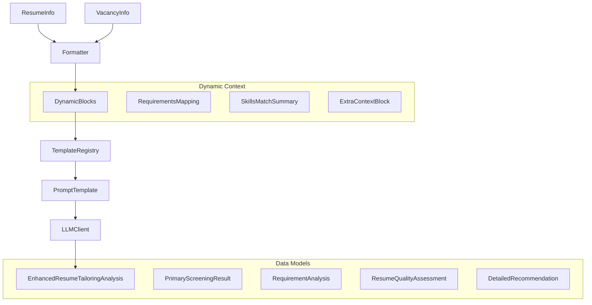
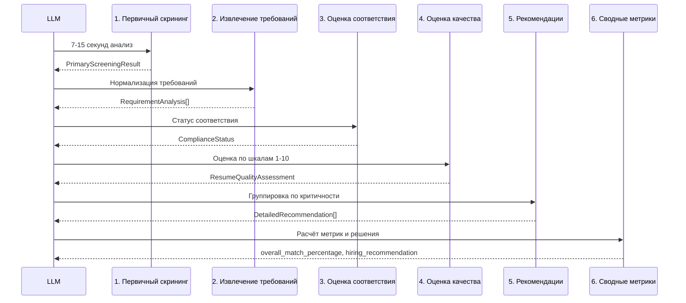
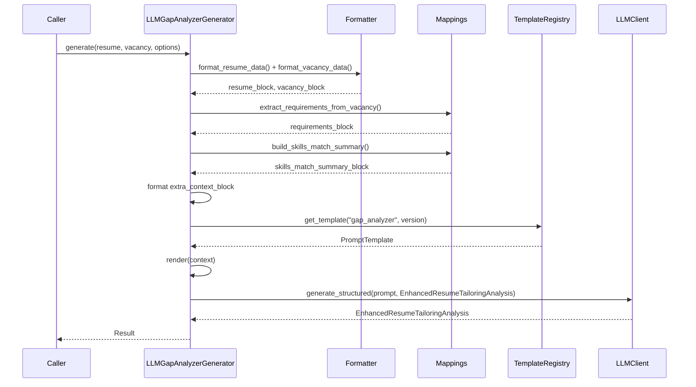

# Компонент: LLM Gap Analyzer

## Обзор

`llm_gap_analyzer` — вторая фича в модульной архитектуре `llm_features`. Библиотечный модуль для генерации детального GAP-анализа соответствия резюме конкретной вакансии с использованием профессиональной HR методологии.

**Интеграция в LLM Features Framework:**
- Наследуется от `AbstractLLMGenerator[EnhancedResumeTailoringAnalysis]`
- Автоматически регистрируется в `FeatureRegistry` при импорте
- Доступна через унифицированное API: `POST /features/gap_analyzer/generate`
- Поддерживает версионирование промптов и унифицированные настройки

Компонент реализует 6-этапную HR методологию анализа: от первичного скрининга до детальных рекомендаций по улучшению резюме.

## Контракт

- `LLMGapAnalyzerGenerator`:
  - `async generate(resume: ResumeInfo, vacancy: VacancyInfo, options: GapAnalyzerOptions) -> EnhancedResumeTailoringAnalysis`
- `GapAnalyzerOptions`: `analysis_depth`, `include_skill_match_summary`, `extra_context`, стандартные LLM настройки.
- Модели: `EnhancedResumeTailoringAnalysis`, `PrimaryScreeningResult`, `RequirementAnalysis`, `DetailedRecommendation`, `ResumeQualityAssessment`.
- Перечисления: `ComplianceStatus`, `RequirementType`, `SkillCategory`, `CriticalityLevel`, `DecisionImpact`, `SectionName`.

## Архитектура



Ключевые компоненты:
- `service.py`: `LLMGapAnalyzerGenerator` с интеграцией в базовый фреймворк
- `formatter.py`: форматирование данных резюме и вакансии
- `prompts/templates.py`: версионируемые шаблоны (`gap_analyzer.v1`)
- `prompts/mappings.py`: динамические блоки для требований и анализа навыков
- `models/gap_analysis_models.py`: комплексная модель данных для HR анализа

## HR Методология (6 этапов)



## Поток выполнения



## Настройки

`GapAnalyzerSettings` (env префикс `GAP_ANALYZER_`):
- `PROMPT_VERSION` (default `gap_analyzer.v1`)
- `TEMPERATURE` (default `0.3`)
- `LANGUAGE` (default `ru`)
- `INCLUDE_SKILL_MATCH_SUMMARY` (default `true`)

Используются также `OPENAI_API_KEY`/`OPENAI_MODEL_NAME` для LLM клиента.

## Модель данных

### EnhancedResumeTailoringAnalysis
Основная модель результата с секциями:
- `primary_screening`: первичный скрининг (должность, стаж, навыки, локация, зарплата)
- `requirements_analysis`: детальный анализ каждого требования с оценкой соответствия
- `quality_assessment`: оценка качества резюме по 4 шкалам (1-10)
- `critical_recommendations`, `important_recommendations`, `optional_recommendations`: группированные рекомендации
- `overall_match_percentage`: расчётный процент соответствия
- `hiring_recommendation`: финальная рекомендация (СИЛЬНО_ДА/ДА/ВОЗМОЖНО/НЕТ/СИЛЬНО_НЕТ)
- `key_strengths`, `major_gaps`, `next_steps`: итоговые выводы

### Ключевые перечисления
- `ComplianceStatus`: FULL_MATCH | PARTIAL_MATCH | MISSING | UNCLEAR
- `RequirementType`: MUST_HAVE | NICE_TO_HAVE | ADDITIONAL_BONUS
- `CriticalityLevel`: CRITICAL | IMPORTANT | DESIRED
- `DecisionImpact`: BLOCKER | HIGH | MEDIUM | LOW

## Пример использования

```python
from src.llm_gap_analyzer import LLMGapAnalyzerGenerator, GapAnalyzerOptions

# resume: ResumeInfo, vacancy: VacancyInfo
generator = LLMGapAnalyzerGenerator()
options = GapAnalyzerOptions(
    analysis_depth="full",
    temperature=0.2,
    extra_context={
        "user_notes": "Обратить внимание на Python опыт",
        "priority_areas": ["технические навыки", "опыт API"]
    }
)

result = await generator.generate(resume, vacancy, options)
print(f"Соответствие: {result.overall_match_percentage}%")
print(f"Рекомендация: {result.hiring_recommendation}")
```

CLI-демо:

```bash
# Генерация GAP анализа
python examples/generate_gap_analysis.py --fake-llm

# Генерация с сохранением результата для PDF тестирования
python examples/generate_gap_analysis.py --fake-llm --save-result

# Тестирование PDF экспорта
python examples/test_pdf_export.py --feature gap_analyzer
```

## PDF Export

GAP Analyzer поддерживает экспорт результатов в профессиональный PDF отчет через модуль `pdf_export`:

### Возможности PDF экспорта:

- **Профессиональный дизайн**: структурированный отчет с цветовой индикацией статусов
- **Полный анализ**: все секции результата (скрининг, требования, качество, рекомендации)
- **Визуальные индикаторы**: цветовая схема для статусов соответствия и критичности
- **Детальные таблицы**: анализ каждого требования с доказательствами и пробелами
- **Итоговая сводка**: процент соответствия, рекомендация по найму, следующие шаги

### Использование:

```bash
# Через WebApp API
curl -X POST http://localhost:8080/features/gap_analyzer/export/pdf \
  -H "Content-Type: application/json" \
  -d '{
    "result": {/* результат GAP анализа */},
    "metadata": {"version": "v1", "language": "ru"}
  }' \
  --output gap_analysis_report.pdf

# Через CLI пример
python examples/test_pdf_export.py --feature gap_analyzer
```

### Структура PDF отчета:

1. **Мета-информация**: дата генерации, версия, заголовок
2. **Первичный скрининг**: результаты по должности, стажу, навыкам, локации, зарплате
3. **Анализ требований**: детальная таблица с доказательствами и пробелами
4. **Оценка качества**: баллы по структуре, релевантности, достижениям, адаптации
5. **Рекомендации**: группированные по критичности (критические, важные, опциональные)
6. **Итоговая сводка**: процент соответствия, сильные стороны, пробелы, следующие шаги

### Цветовая схема:

- 🟢 **Зеленый**: полное соответствие, положительные статусы
- 🔴 **Красный**: критические проблемы, отсутствующие требования
- 🟡 **Желтый**: частичное соответствие, предупреждения
- 🔵 **Синий**: информационные элементы, нейтральные статусы

## Унификация с другими фичами

- **Поддержка `extra_context`**: единый контракт для пользовательских указаний
- **Универсальное API**: доступ через `/features/gap_analyzer/generate`
- **Единые базовые настройки**: наследование от `BaseLLMOptions`
- **Интеграция с существующими компонентами**: переиспользование `analyze_skills_match` из `llm_cover_letter`
- **PDF Export**: поддержка экспорта через унифицированную систему форматтеров

## Расширение

- Добавьте новые версии промптов в `prompts/templates.py` с обновлённой методологией
- Расширьте модели данных в `gap_analysis_models.py` для новых типов анализа  
- Кастомизируйте форматтеры в `formatter.py` для специфических доменов
- Переопределите `_merge_with_defaults()` для бизнес-специфичных настроек
