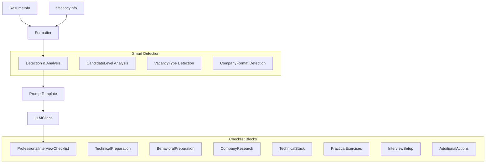
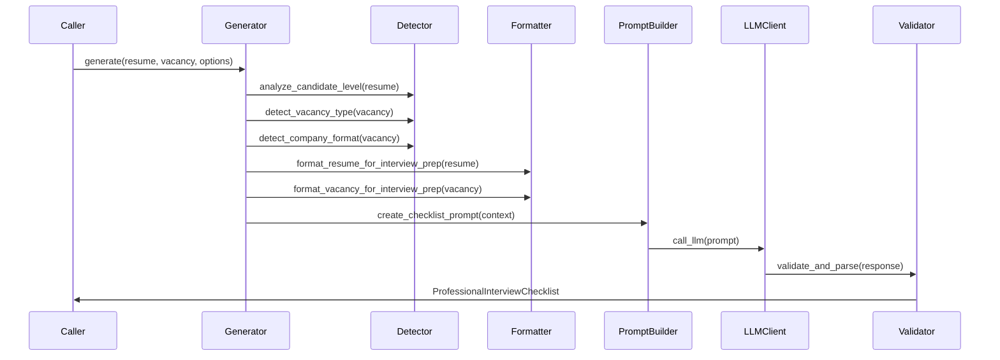

# Компонент: LLM Interview Checklist

## Обзор

`llm_interview_checklist` — третья фича в модульной архитектуре `llm_features`. Библиотечный модуль для генерации профессиональных чек-листов подготовки к интервью на основе `ResumeInfo` и `VacancyInfo` с использованием HR-экспертизы.

**Интеграция в LLM Features Framework:**
- Наследуется от `AbstractLLMGenerator[ProfessionalInterviewChecklist]`
- Автоматически регистрируется в `FeatureRegistry` при импорте
- Доступна через унифицированное API: `POST /features/interview_checklist/generate`
- Поддерживает версионирование промптов и унифицированные настройки

Компонент создает персонализированные чек-листы с адаптацией под уровень кандидата (JUNIOR/MIDDLE/SENIOR/LEAD), тип роли (DEVELOPER/QA/DATA_SPECIALIST) и формат компании (STARTUP/MEDIUM/LARGE_CORP/INTERNATIONAL).

## Контракт

- `LLMInterviewChecklistGenerator`:
  - `async generate(resume: ResumeInfo, vacancy: VacancyInfo, options: InterviewChecklistOptions) -> ProfessionalInterviewChecklist`
- `InterviewChecklistOptions`: `candidate_level_override`, `vacancy_type_override`, `company_format_override`, `preparation_time_days`, `focus_areas`, стандартные LLM настройки.
- Модели: `ProfessionalInterviewChecklist`, `PersonalizationContext`, `PreparationTimeEstimate`, блоки подготовки (Technical, Behavioral, Company Research и др.).
- Перечисления: `CandidateLevel`, `VacancyType`, `CompanyFormat`, `Priority`, `FocusArea`.

## Архитектура



- `formatter.py`: форматирование резюме и вакансии для контекста подготовки к интервью.
- `prompts/templates.py`: шаблон для создания профессионального чек-листа.
- `prompts/mappings.py`: автоопределение уровня кандидата, типа вакансии и формата компании.
- `service.py`: `LLMInterviewChecklistGenerator` (основной генератор с HR методологией).
- `models.py`: детальные Pydantic модели для всех блоков чек-листа.

## Поток



1. **Анализ контекста**: Автоматическое определение уровня кандидата, типа роли и формата компании
2. **Форматирование**: Подготовка контекста резюме и вакансии для генерации чек-листа
3. **Генерация промпта**: Создание специализированного промпта с HR методологией
4. **LLM вызов**: Генерация структурированного чек-листа
5. **Валидация**: Парсинг и валидация результата в модель `ProfessionalInterviewChecklist`

## Конфигурация

### Настройки окружения
```bash
# Основные настройки
INTERVIEW_CHECKLIST_MODEL_NAME=gpt-4o-mini-2024-07-18
INTERVIEW_CHECKLIST_TEMPERATURE=0.3
INTERVIEW_CHECKLIST_MAX_TOKENS=4000

# Настройки адаптации
INTERVIEW_CHECKLIST_DEFAULT_PREP_TIME_DAYS=7
INTERVIEW_CHECKLIST_ENABLE_BEHAVIORAL_QUESTIONS=true
INTERVIEW_CHECKLIST_INCLUDE_PRACTICAL_EXERCISES=true
```

### Структура опций
```python
@dataclass
class InterviewChecklistOptions(BaseLLMOptions):
    candidate_level_override: Optional[CandidateLevel] = None
    vacancy_type_override: Optional[VacancyType] = None  
    company_format_override: Optional[CompanyFormat] = None
    preparation_time_days: int = 7
    focus_areas: List[FocusArea] = field(default_factory=lambda: [
        FocusArea.TECHNICAL, 
        FocusArea.BEHAVIORAL, 
        FocusArea.COMPANY_RESEARCH
    ])
```

## Основные блоки чек-листа

### 1. **Техническая подготовка** (`TechnicalPreparationItem`)
- Изучение технологий из стека вакансии
- Практические задания и кодинг-интервью
- Архитектурные вопросы для уровня кандидата

### 2. **Поведенческие навыки** (`BehavioralPreparationItem`)  
- STAR-методика подготовки ответов
- Примеры из опыта под вакансию
- Soft skills для роли и уровня

### 3. **Исследование компании** (`CompanyResearchItem`)
- Изучение продуктов, миссии, ценностей
- Анализ конкурентов и рынка
- Подготовка вопросов интервьюерам

### 4. **Технический стек** (`TechnicalStackItem`)
- Глубокое изучение ключевых технологий
- Практические примеры применения
- Альтернативы и сравнение решений

### 5. **Практические упражнения** (`PracticalExerciseItem`)
- Кодинг задачи по уровню
- Системный дизайн (для Middle+)
- Peer programming подготовка

### 6. **Настройка окружения** (`InterviewSetupItem`)
- Техническая подготовка к удаленному интервью
- Подготовка рабочего места и инструментов
- Резервные планы связи

### 7. **Дополнительные действия** (`AdditionalActionItem`)
- Networking и связи в компании
- Портфолио и проекты для демонстрации
- Последние новости индустрии

## Использование

### A. Через унифицированное API
```bash
# Базовая генерация чек-листа
curl -X POST "http://localhost:8080/features/interview_checklist/generate?version=v1" \
  -H "Content-Type: application/json" \
  -d '{
    "session_id": "<uuid>",
    "options": {
      "preparation_time_days": 10,
      "focus_areas": ["TECHNICAL", "BEHAVIORAL", "COMPANY_RESEARCH"]
    }
  }'

# С переопределением параметров  
curl -X POST "http://localhost:8080/features/interview_checklist/generate?version=v1" \
  -H "Content-Type: application/json" \
  -d '{
    "resume": { /* ResumeInfo */ },
    "vacancy": { /* VacancyInfo */ },
    "options": {
      "candidate_level_override": "SENIOR",
      "company_format_override": "STARTUP", 
      "preparation_time_days": 14
    }
  }'
```

### B. Программное использование
```python
from src.llm_interview_checklist import LLMInterviewChecklistGenerator, InterviewChecklistOptions
from src.models.resume_models import ResumeInfo
from src.models.vacancy_models import VacancyInfo

generator = LLMInterviewChecklistGenerator()
options = InterviewChecklistOptions(
    preparation_time_days=10,
    focus_areas=[FocusArea.TECHNICAL, FocusArea.BEHAVIORAL]
)

checklist = await generator.generate(resume, vacancy, options)
```

### C. Legacy CLI
```bash
# Генерация чек-листа с сохранением результата
python -m examples.generate_interview_checklist \
  --resume-pdf tests/data/resume.pdf \
  --vacancy tests/data/vacancy.json \
  --prep-days 14
```

## PDF Export

Поддерживает экспорт через систему `pdf_export` с профессиональным форматированием:

```bash
curl -X POST http://localhost:8080/features/interview_checklist/export/pdf \
  -H "Content-Type: application/json" \
  -d '{
    "result": { /* ProfessionalInterviewChecklist */ },
    "metadata": {"language": "ru"}
  }' \
  --output interview_checklist_report.pdf
```

## Тестирование

- **Unit тесты**: `tests/llm_features/test_interview_checklist_unit.py`
- **Integration тесты**: `tests/llm_features/test_interview_checklist_integration.py`
- **API тесты**: покрываются в `tests/llm_features/test_features_api.py`

```bash
# Запуск тестов Interview Checklist
pytest tests/llm_features/ -k interview_checklist -v
```

## Расширения

Компонент легко расширяется:
- **Новые типы ролей**: добавить в `VacancyType` enum
- **Дополнительные блоки подготовки**: создать новые модели и обновить шаблон
- **Локализация**: добавить поддержку других языков в промпты
- **Интеграция с календарем**: добавить временные планы подготовки

Подробнее о добавлении новых фич: `src/llm_features/README.md`
