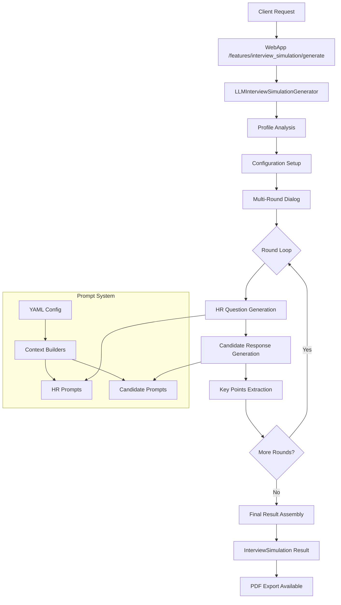

# Компонент: LLM Interview Simulation

## 1. Обзор

`LLM Interview Simulation` — четвертая фича в LLM Features Framework, реализующая полноценную симуляцию интервью между AI HR-менеджером и AI кандидатом на основе реального резюме и вакансии.

Основные обязанности:
- Проведение многораундового структурированного интервью
- Адаптивные вопросы в зависимости от уровня кандидата (junior/middle/senior/lead)
- Генерация реалистичного диалога HR ↔ Candidate
- Покрытие различных типов вопросов (технические, поведенческие, мотивационные)
- Детальная аналитика и статистика интервью
- PDF экспорт с профессиональным форматированием

## 2. Архитектура



## 3. Компоненты

### 3.1 LLMInterviewSimulationGenerator (`src/llm_interview_simulation/service.py`)

Основной генератор симуляции интервью:

```python
class LLMInterviewSimulationGenerator(AbstractLLMGenerator[InterviewSimulation]):
    async def generate(
        self,
        resume: ResumeInfo,
        vacancy: VacancyInfo, 
        options: InterviewSimulationOptions
    ) -> InterviewSimulation
```

**Основной поток:**
1. Анализ резюме → автоопределение уровня кандидата и IT-роли
2. Создание конфигурации интервью под уровень кандидата
3. Проведение многораундового диалога (3-7 раундов)
4. Сбор статистики и метаданных
5. Формирование итогового результата

### 3.2 Модели данных (`src/llm_interview_simulation/models.py`)

**Основные модели:**

#### InterviewSimulation
Итоговый результат симуляции:
- `position_title`, `candidate_name`, `company_context`
- `candidate_profile: CandidateProfile` 
- `interview_config: InterviewConfiguration`
- `dialog_messages: List[DialogMessage]`
- `simulation_metadata: Dict[str, Any]`

#### DialogMessage
Сообщение в диалоге:
- `speaker: "HR" | "Candidate"`
- `message: str` 
- `round_number: int`
- `question_type: QuestionType` (для HR)
- `key_points: List[str]`

#### CandidateProfile
Автоопределенный профиль:
- `detected_level: CandidateLevel` (junior/middle/senior/lead)
- `detected_role: ITRole` (developer/qa/devops/etc.)
- `years_of_experience: int`
- `key_technologies: List[str]`
- `management_experience: bool`

### 3.3 Система промптов (`src/llm_interview_simulation/prompts/`)

**Унифицированная YAML-конфигурация** (`config.yml`):
- Шаблоны для HR и Candidate с Jinja2 переменными
- Локализованные персоны, стили, инструкции по типам вопросов
- Адаптация под уровень кандидата и специфику роли
- Настройки температуры и поведения

**Context Builders** (`prompts/context.py`):
- `build_hr_context()` — контекст для HR промптов
- `build_candidate_context()` — контекст для Candidate промптов
- Динамическая сборка переменных: уровень, роль, раунд, история, фокус-области

### 3.4 Конфигурация (`src/llm_interview_simulation/config.py`)

**Иерархия переопределения:**
1. Runtime опции (`InterviewSimulationOptions`)
2. YAML конфиг (`config.yml`) 
3. Python дефолты (`default_settings`)

**Ключевые настройки:**
- Количество раундов по уровням (junior: 4, middle: 5, senior: 6, lead: 7)
- Маппинг раундов на типы вопросов
- Температуры для HR (0.7) и Candidate (0.8)
- Фокус-области и приоритеты

## 4. Типы вопросов (QuestionType)

Система поддерживает 9 типов вопросов:

1. **INTRODUCTION** — знакомство и общие вопросы
2. **TECHNICAL_SKILLS** — проверка технических навыков
3. **EXPERIENCE_DEEP_DIVE** — глубокое обсуждение опыта 
4. **BEHAVIORAL_STAR** — поведенческие вопросы (STAR методика)
5. **PROBLEM_SOLVING** — решение проблем и кейсы
6. **MOTIVATION** — мотивация и цели
7. **CULTURE_FIT** — соответствие культуре
8. **LEADERSHIP** — лидерские качества (для senior/lead)
9. **FINAL** — финальные вопросы

## 5. PDF Export

### 5.1 InterviewSimulationPDFFormatter (`src/pdf_export/formatters/interview_simulation.py`)

Полнофункциональный PDF форматтер с:
- Локализацией всех енумов на русский язык
- Группировкой диалога по раундам
- Статистикой интервью и покрытием типов вопросов
- Анализом профиля кандидата

### 5.2 HTML Template (`src/pdf_export/templates/interview_simulation.html`)

**Секции PDF отчета:**
- **Заголовок**: позиция, дата генерации, версия
- **Краткая сводка**: кандидат, конфигурация, статистика
- **Детальный профиль**: технологии, компании, образование
- **Покрытие вопросов**: визуальные индикаторы типов
- **Полный диалог**: по раундам с HR/Candidate разделением
- **Метаданные**: техническая информация

### 5.3 CSS Стили (`src/pdf_export/styles/interview_simulation.css`)

**Дизайн-система:**
- HR сообщения: синий фон (#007bff)
- Candidate сообщения: зеленый фон (#28a745)
- Адаптивная сетка и карточки
- Бейджи для уровней, технологий, типов вопросов
- Print-оптимизация с правильными переносами страниц

## 6. API интеграция

### 6.1 WebApp роуты

```bash
POST /features/interview_simulation/generate
{
  "resume": ResumeInfo,
  "vacancy": VacancyInfo,
  "options": {
    "target_rounds": 5,
    "difficulty_level": "medium",
    "hr_personality": "neutral",
    "candidate_confidence": "medium",
    "include_behavioral": true,
    "include_technical": true
  }
}
```

### 6.2 PDF Export

```bash
POST /features/interview_simulation/export/pdf
{
  "result": InterviewSimulation,
  "metadata": {
    "feature_name": "interview_simulation",
    "version": "v1.1-configurable"
  }
}
```

## 7. Примеры использования

### 7.1 CLI генерация с трейсингом

```bash
# Создать примерные данные и запустить симуляцию
python examples/generate_interview_simulation.py --create-sample --fake-llm --trace

# Реальное интервью с сохранением для PDF
python examples/generate_interview_simulation.py \
  --resume-pdf resume.pdf \
  --vacancy-json vacancy.json \
  --save-result
```

### 7.2 PDF генерация

```bash
# Генерация PDF из сохраненного результата
python examples/test_pdf_export.py \
  --feature interview_simulation \
  --result-file interview_simulation_result_20250820_104305.json
```

### 7.3 Программное использование

```python
from src.llm_interview_simulation import LLMInterviewSimulationGenerator, InterviewSimulationOptions

generator = LLMInterviewSimulationGenerator()
options = InterviewSimulationOptions(
    target_rounds=5,
    difficulty_level="hard",
    hr_personality="challenging"
)

result = await generator.generate(resume, vacancy, options)
print(f"Проведено раундов: {result.total_rounds_completed}")
print(f"Типы вопросов: {[qt.value for qt in result.covered_question_types]}")
```

## 8. Конфигурация и настройка

### 8.1 Основные опции InterviewSimulationOptions

- `target_rounds: int` — количество раундов (3-7)
- `difficulty_level: "easy" | "medium" | "hard"` — сложность
- `hr_personality: "supportive" | "neutral" | "challenging"` — стиль HR
- `candidate_confidence: "low" | "medium" | "high"` — уверенность кандидата
- `include_behavioral: bool` — поведенческие вопросы
- `include_technical: bool` — технические вопросы  
- `include_leadership: Optional[bool]` — лидерские вопросы (автоопределение)

### 8.2 Переопределение конфигурации

```bash
# Использование кастомного YAML конфига
python examples/generate_interview_simulation.py \
  --config custom_config.yml \
  --resume-pdf resume.pdf \
  --vacancy-json vacancy.json
```

## 9. Особенности реализации

### 9.1 Generation-Only подход
- **Без оценки**: фокус только на генерации реалистичного диалога
- **Упрощенная архитектура**: нет scoring или assessment логики
- **Предсказуемое поведение**: четкие контракты и конфигурация

### 9.2 Адаптивность
- **По уровню**: junior получает поддерживающие вопросы, senior — сложные
- **По роли**: специфичные вопросы для developer/qa/devops
- **По конфигурации**: гибкие настройки под разные сценарии

### 9.3 Трейсинг и отладка
- Полное логирование всех промптов и ответов
- Сохранение pipeline данных для анализа
- Детальные метаданные для troubleshooting

## 10. Интеграция с LLM Features Framework

Фича полностью интегрирована в существующую архитектуру:
- ✅ Автоматическая регистрация через `bootstrap.py`
- ✅ Унифицированное API `/features/interview_simulation/generate`
- ✅ PDF экспорт через существующую систему
- ✅ Версионирование и feature management
- ✅ Стандартные опции и валидация
- ✅ WebApp интеграция с правильным маппингом опций