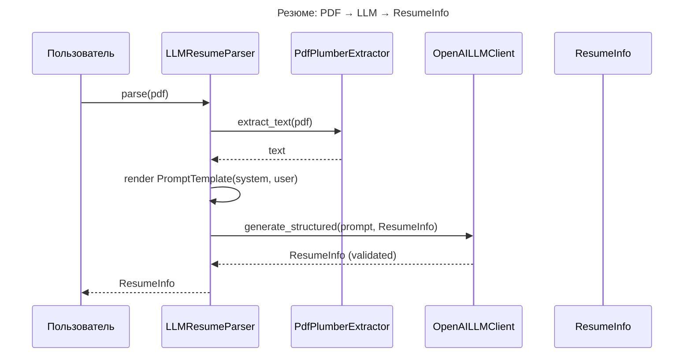
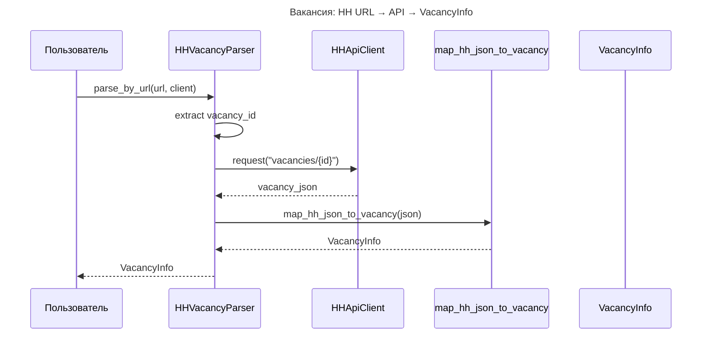

# Компонент: Parser (Resume & Vacancy)

## Обзор

Компонент `parsing` решает две задачи:
- Извлечение резюме из PDF и преобразование в `ResumeInfo` через LLM (OpenAI structured output).
- Получение вакансии по ссылке HH и маппинг в `VacancyInfo` без участия LLM.

Обе задачи построены атомарно: экстракция, LLM и маппинг разделены контрактами и могут заменяться независимо.

## Структура

- `src/parsing/llm/` — абстракция LLM:
  - `client.py` — `LLMClient`, `OpenAILLMClient` (response_format=Pydantic)
  - `prompt.py` — `Prompt`, `PromptTemplate` (system+user, версии)
  - `errors.py` — ошибки LLM-слоя (вызовы и валидация)
- `src/parsing/resume/` — резюме:
  - `pdf_extractor.py` — `IPDFExtractor`, `PdfPlumberExtractor` (path/bytes)
  - `parser.py` — `IResumeParser`, `LLMResumeParser`
- `src/parsing/vacancy/` — вакансии:
  - `mapper.py` — `map_hh_json_to_vacancy` (очистка HTML, нормализация)
  - `parser.py` — `HHVacancyParser` (извлечение id из URL)
- Доменные модели: `src/models/resume_models.py`, `src/models/vacancy_models.py`

## Контракты

- `LLMClient.generate_structured(prompt, schema, ...) -> BaseModel`
- `IResumeParser.parse(src) -> ResumeInfo`
- `HHVacancyParser.parse_by_url(url, client) -> VacancyInfo`

## Потоки

- Резюме: PDF → `PdfPlumberExtractor` → `PromptTemplate` → `OpenAILLMClient` → `ResumeInfo`.
- Вакансия: URL → `HHApiClient.request("vacancies/{id}")` → `map_hh_json_to_vacancy` → `VacancyInfo`.

## Диаграммы

## Дизайн LLM-слоя

- `LLMClient` — общий контракт; адаптеры провайдеров прокидывают Pydantic JSON Schema в провайдер.
- `OpenAILLMClient` использует `openai.beta.chat.completions.parse` с `response_format=<PydanticModel>` и возвращает инстанс модели.
- Валидация: дополнительно прогоняем `model_validate` для строгой проверки.
- Логирование: модель, длины промптов, успех/ошибки валидации.

## Промпты

- `PromptTemplate` хранит имя и версию; поддерживает `.render(context)` для формирования `Prompt(system, user)`.
- Шаблон резюме включает правила извлечения (skills/experience/education/языки/зарплата/опыт в месяцах).
- Версионирование позволяет безопасно менять указания без влияния на другие задания.

## Логирование

- Resume: извлечение текста (длина), вызов LLM (имя/версия шаблона), итоговые ФИО (если есть).
- Vacancy: извлечение id из URL, успешный маппинг (название/компания).
- LLM: параметры генерации, ошибки сетевые и ошибки схемы.

## Обработка ошибок

- PDF: `FileNotFoundError`, `RuntimeError` при пустом тексте.
- LLM: `LLMCallError` (сеть/квоты), `SchemaValidationError` (ответ вне схемы).
- Vacancy: `ValueError` при некорректном URL, далее ошибки клиента HH оборачиваются на уровне клиента.

## Настройки

- `OPENAI_API_KEY` — ключ провайдера.
- `OPENAI_MODEL_NAME` — имя модели (по умолчанию `gpt-4o-mini-2024-07-18`).

## Расширение

- Новые LLM-задачи: добавить новый `PromptTemplate` + Pydantic схему и вызывать `LLMClient.generate_structured`.
- Замена экстрактора PDF: реализовать `IPDFExtractor` и передать в `LLMResumeParser`.
- Альтернативные провайдеры LLM: реализовать новый класс `LLMClient`-совместимый адаптер.

## Пример использования

- Резюме:
  - `await LLMResumeParser().parse("/path/to/resume.pdf")`
- Вакансия:
  - `await HHVacancyParser().parse_by_url("https://hh.ru/vacancy/123456", client)`

## Интеграция с WebApp (сессии)

В режиме инициализации сессии из сырого ввода (upload) вызовы парсеров выполняются из `WebApp` (см. `src/webapp/sessions.py`):

- `POST /sessions/init_upload` принимает `resume_file` (PDF) и `vacancy_url` и реализует следующий поток:
  - Извлечение текста из PDF (`PdfPlumberExtractor`) и подсчёт хэша по тексту; если резюме уже есть в БД — парсинг LLM пропускается.
  - Извлечение `vacancy_id` из URL и подсчёт хэша; если вакансия уже есть в БД — запрос к HH API пропускается.
  - При отсутствии в БД: вызывается `LLMResumeParser.parse(bytes)` и `HHVacancyParser.parse_by_url(url, HHApiClient)`.
  - Оба результата сохраняются в SQLite (`resume_docs`, `vacancy_docs`) и связываются в `sessions`.
- Повторные фичи в рамках одной сессии используют `session_id` и не триггерят парсеры повторно.

Это позволяет экономить вызовы LLM и HH API, обеспечивая contract-first подход: внешний клиент передаёт сырой файл и ссылку, а WebApp берёт на себя дедупликацию и персистентность.
