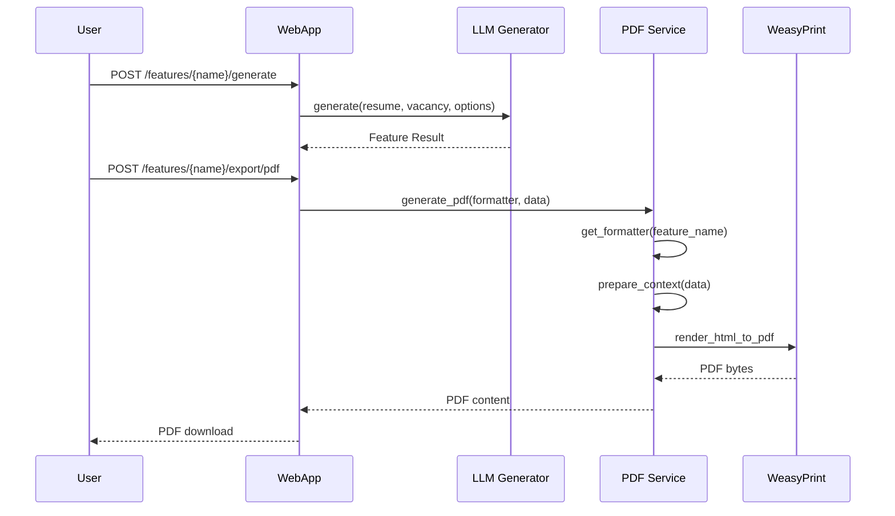

# Компонент: PDF Export

## 1. Обзор

`PDF Export` — модульная система экспорта результатов LLM-фич в профессиональный PDF формат. Компонент обеспечивает единообразный подход к генерации PDF отчетов для всех зарегистрированных фич в LLM Features Framework.

Основные обязанности:
- Экспорт структурированных результатов LLM-фич в PDF формат
- Рендеринг HTML шаблонов с профессиональными CSS стилями
- Модульная архитектура с поддержкой новых фич через форматтеры
- Интеграция с WebApp API через унифицированные роуты
- Обеспечение консистентного дизайна всех PDF отчетов

## 2. Архитектура

```mermaid
graph TD
    A[Client Request] --> B[WebApp /features/{feature_name}/export/pdf]
    B --> C[PDFExportService]
    C --> D[Formatter Registry]
    D --> E{Feature Type}
    
    E -->|gap_analyzer| F[GapAnalyzerPDFFormatter]
    E -->|cover_letter| G[CoverLetterPDFFormatter]
    E -->|interview_checklist| IC[InterviewChecklistPDFFormatter]
    E -->|interview_simulation| IS[InterviewSimulationPDFFormatter]
    E -->|future_feature| H[Future Formatters...]
    
    F --> I[prepare_context]
    G --> I
    IC --> I
    IS --> I
    H --> I
    
    I --> J[HTML Template]
    J --> K[Jinja2 Rendering]
    K --> L[CSS Styling]
    L --> M[WeasyPrint]
    M --> N[PDF Output]
```

## 3. Компоненты

### 3.1 PDFExportService (`src/pdf_export/service.py`)

Основной сервис для генерации PDF документов:

```python
class PDFExportService:
    async def generate_pdf(
        self,
        formatter: AbstractPDFFormatter,
        data: Dict[str, Any],
        metadata: Dict[str, Any],
    ) -> bytes
```

**Обязанности:**
- Управление реестром форматтеров
- Координация процесса генерации PDF
- Обработка ошибок и валидация данных
- Настройка WeasyPrint для корректного рендеринга

### 3.2 AbstractPDFFormatter (`src/pdf_export/formatters/base.py`)

Базовый класс для всех форматтеров фич:

```python
class AbstractPDFFormatter(ABC):
    @property
    @abstractmethod
    def feature_name(self) -> str
    
    @property
    @abstractmethod
    def template_name(self) -> str
    
    @abstractmethod
    def prepare_context(self, data: Dict[str, Any], metadata: Dict[str, Any]) -> Dict[str, Any]
```

**Контракт:**
- `feature_name` — идентификатор фичи для регистрации
- `template_name` — имя HTML шаблона (например, `gap_analyzer.html`)
- `prepare_context()` — преобразование данных фичи в контекст для шаблона

### 3.3 Реализованные форматтеры

#### GapAnalyzerPDFFormatter (`src/pdf_export/formatters/gap_analyzer.py`)

Форматтер для GAP анализа резюме:

**Секции PDF:**
- Мета-информация (дата генерации, версия)
- Первичный скрининг с индикаторами
- Детальный анализ требований
- Оценка качества резюме
- Рекомендации по улучшению (критические, важные, опциональные)
- Итоговая сводка с процентом соответствия

**Ключевые методы:**
- `_translate_*()` — перевод enum значений в человекочитаемый текст
- `_get_*_css_class()` — CSS классы для визуальных индикаторов
- Обработка списков рекомендаций и требований

#### CoverLetterPDFFormatter (`src/pdf_export/formatters/cover_letter.py`)

Форматтер для сопроводительных писем:

**Секции PDF:**
- Мета-информация о роли и компании
- Анализ соответствия навыков
- Стратегия персонализации
- Полный текст письма (структурированно)
- Оценки качества письма
- Рекомендации по улучшению

**Особенности:**
- Форматирование дат и времени
- Обработка многострочного текста письма
- Прогресс-бары для оценок качества

#### InterviewChecklistPDFFormatter (`src/pdf_export/formatters/interview_checklist.py`)

Форматтер для профессионального чек-листа подготовки к интервью.

**Секции PDF:**
- Мета-информация (дата генерации, версия, компания, позиция)
- Персонализация: уровень/тип/формат, ключевые пробелы, сильные стороны, критические фокусы
- Оценка времени: total/critical/important/optional + рекомендуемый распорядок
- Блок 1: Техническая подготовка — по категориям, с приоритетами, временем, ресурсами, критериями успеха
- Блок 2: Поведенческая подготовка — вопросы, STAR-метод, советы
- Блок 3: Исследование компании — конкретные действия, приоритеты, время
- Блок 4: Технический стек и процессы — почему важно, как изучать
- Блок 5: Практика и кейсы — сложность, ресурсы, ожидаемый результат
- Блок 6: Окружение интервью — чек‑листы, важность
- Блок 7: Дополнительные действия — срочность, шаги выполнения
- Итог: критические факторы успеха, типичные ошибки, last‑minute чек‑лист, мотивация

**Особенности:**
- Локализация enum‑значений (уровень, тип роли, формат компании, приоритеты)
- Визуальные бейджи приоритетов и сложности
- Группировка технических задач по категориям

#### InterviewSimulationPDFFormatter (`src/pdf_export/formatters/interview_simulation.py`)

Форматтер для полноценной симуляции интервью между AI HR-менеджером и AI кандидатом.

**Секции PDF:**
- Заголовок отчета (позиция, дата, версия, компания)
- Краткая сводка интервью — 3 карточки:
  - Информация о кандидате (имя, уровень, роль, опыт, управленческий опыт)
  - Конфигурация интервью (раундов, сложность, типы вопросов, фокус-области)
  - Статистика интервью (всего сообщений, HR вопросов, ответов кандидата, типов вопросов, ключевых моментов)
- Детальный профиль кандидата (ключевые технологии, предыдущие компании, образование)
- Покрытие типов вопросов — визуальная сетка с индикаторами (введение, технические навыки, опыт, поведенческие, решение проблем, мотивация, культурное соответствие, лидерство, финальные)
- Полный диалог интервью — по раундам с четким разделением HR (синий) vs Candidate (зеленый)
- Технические метаданные (для troubleshooting)

**Особенности:**
- Полная локализация всех enum значений (CandidateLevel, ITRole, QuestionType, etc.)
- Цветовое разделение: HR сообщения (синий #007bff), Candidate сообщения (зеленый #28a745)
- Группировка диалога по раундам с указанием типа вопроса
- Визуальные бейджи для уровней, технологий, типов вопросов
- Обработка ключевых моментов и временных меток
- Адаптивная верстка для правильных переносов страниц

## 4. Шаблоны и стили

### 4.1 HTML шаблоны (`src/pdf_export/templates/`)

Каждая фича имеет свой шаблон:
- `gap_analyzer.html` — профессиональный анализ с таблицами
- `cover_letter.html` — структурированное письмо с секциями  
- `interview_checklist.html` — профессиональный чек-лист подготовки к интервью
- `interview_simulation.html` — полный отчет симуляции интервью с диалогом

**Структура шаблона:**
```html
<!DOCTYPE html>
<html>
<head>
    <meta charset="utf-8">
    <title>{{ title }}</title>
    <style>
        
        
    </style>
</head>
<body>
    <div class="container">
        <!-- Feature-specific content -->
    </div>
</body>
</html>
```

### 4.2 CSS стили (`src/pdf_export/styles/`)

**Базовые стили (`base.css`):**
- Общие стили для всех PDF (шрифты, отступы, контейнеры)
- Утилитарные классы для статусов и индикаторов
- Responsive дизайн для PDF формата

**Фича-специфичные стили:**
- `gap_analyzer.css` — стили для анализа (таблицы требований, статусы)
- `cover_letter.css` — стили для письма (секции, прогресс-бары)
- `interview_checklist.css` — стили для чек-листа (блоки, приоритеты, бейджи)
- `interview_simulation.css` — стили для симуляции (диалог, раунды, цветовое кодирование HR/Candidate)

**Цветовая схема:**
- Зеленый (#28a745) — положительные статусы
- Красный (#dc3545) — критические проблемы
- Желтый (#ffc107) — предупреждения
- Синий (#007bff) — информационные элементы

## 5. API интеграция

### 5.1 WebApp роуты (`src/webapp/pdf.py`)

```python
@router.post("/{feature_name}/export/pdf")
async def export_feature_pdf(feature_name: str, request: PDFExportRequest) -> Response
```

**Запрос:**
```json
{
  "result": { /* результат фичи */ },
  "metadata": {
    "version": "v1",
    "language": "ru",
    "generated_at": "2025-08-17T10:00:00"
  }
}
```

**Ответ:**
- Content-Type: `application/pdf`
- Binary PDF content
- Filename header для скачивания

### 5.2 Примеры использования

**Генерация PDF через API:**
```bash
curl -X POST http://localhost:8080/features/gap_analyzer/export/pdf \\
  -H "Content-Type: application/json" \\
  -d '{
    "result": { /* результат GAP анализа */ },
    "metadata": {"language": "ru"}
  }' \\
  --output report.pdf
```

**Интеграция с фичами:**
```python
# 1. Генерируем результат фичи
result = await generator.generate(resume, vacancy, options)

# 2. Экспортируем в PDF
pdf_content = await pdf_service.generate_pdf(
    feature_name="gap_analyzer",
    data=result.model_dump(),
    metadata={"feature_name": "gap_analyzer", "version": "v1"}
)
```

## 6. Workflow интеграция

### 6.1 Полный workflow



### 6.2 CLI примеры

Существующие примеры поддерживают PDF workflow:

**GAP анализ:**
```bash
# Генерируем и сохраняем результат
python examples/generate_gap_analysis.py --save-result --fake-llm

# Тестируем PDF генерацию
python examples/test_pdf_export.py --feature gap_analyzer
```

**Cover Letter:**
```bash
# Генерируем и сохраняем результат
python examples/generate_cover_letter.py --save-result --fake-llm

# Тестируем PDF генерацию
python examples/test_pdf_export.py --feature cover_letter
```

**Interview Simulation:**
```bash
# Генерируем и сохраняем результат
python examples/generate_interview_simulation.py --save-result --fake-llm

# Тестируем PDF генерацию с реальным файлом результата
python examples/test_pdf_export.py --feature interview_simulation \
  --result-file interview_simulation_result_20250820_104305.json
```

## 7. Расширение под новые фичи

### 7.1 Добавление нового форматтера

1. **Создать форматтер:**
```python
# src/pdf_export/formatters/new_feature.py
class NewFeaturePDFFormatter(AbstractPDFFormatter):
    @property
    def feature_name(self) -> str:
        return "new_feature"
    
    @property  
    def template_name(self) -> str:
        return "new_feature.html"
    
    def prepare_context(self, data: Dict[str, Any], metadata: Dict[str, Any]) -> Dict[str, Any]:
        # Преобразование данных для шаблона
        return {...}
```

2. **Создать шаблон:**
```html
<!-- src/pdf_export/templates/new_feature.html -->
<!DOCTYPE html>
<html>
<head>
    <style>
        
        
    </style>
</head>
<body>
    <!-- Контент фичи -->
</body>
</html>
```

3. **Создать стили:**
```css
/* src/pdf_export/styles/new_feature.css */
.new-feature-specific {
    /* Стили специфичные для фичи */
}
```

4. **Зарегистрировать в сервисе:**
```python
# src/pdf_export/service.py или src/webapp/pdf.py
from .formatters.new_feature import NewFeaturePDFFormatter

_formatters_registry = {
    "gap_analyzer": GapAnalyzerPDFFormatter(),
    "cover_letter": CoverLetterPDFFormatter(),
    "interview_checklist": InterviewChecklistPDFFormatter(),
    "interview_simulation": InterviewSimulationPDFFormatter(),
    "new_feature": NewFeaturePDFFormatter(),  # Добавить здесь
}
```

### 7.2 Лучшие практики

**Дизайн:**
- Используйте базовые CSS классы для консистентности
- Следуйте цветовой схеме существующих форматтеров
- Тестируйте PDF в разных браузерах и PDF просмотрщиках

**Производительность:**
- Оптимизируйте размер CSS (избегайте дублирования)
- Используйте эффективные селекторы
- Кэшируйте статические ресурсы при необходимости

**Тестирование:**
- Создавайте unit тесты для форматтеров
- Добавляйте integration тесты для PDF генерации
- Тестируйте с реальными данными фич

## 8. Технические детали

### 8.1 Зависимости

- **WeasyPrint** — рендеринг HTML в PDF
- **Jinja2** — шаблонизация HTML
- **CSS3** — стилизация для печати

### 8.2 Настройки WeasyPrint

```python
HTML(string=html_content).write_pdf(
    stylesheets=[],
    optimize_images=True,
    presentational_hints=True
)
```

### 8.3 Обработка ошибок

- `ValueError` — неизвестная фича или некорректные данные
- `TemplateNotFound` — отсутствует HTML шаблон
- `WeasyPrint errors` — ошибки рендеринга PDF

#### 8.4 Контракт обработки неполных/некорректных данных (временно)

- Политика по умолчанию — «lenient»: при отсутствии части полей форматтеры используют дефолтные значения и рендер продолжается без исключений.
- Соответствующие интеграционные/E2E‑тесты, ожидавшие исключения на пустых/повреждённых входных данных, временно отключены (`pytest.mark.skip`).
- Если потребуется «strict» режим, он будет оформлен как контракт‑параметр и задокументирован отдельно (и тесты будут возвращены).

## 9. Тестирование

### 9.1 Структура тестов

```
tests/pdf_export/
├── conftest.py              # Общие фикстуры
├── test_formatters.py       # Unit тесты форматтеров
├── test_integration.py      # Integration тесты сервиса
└── test_e2e.py             # End-to-end тесты workflow
```

### 9.2 Типы тестов

**Unit тесты:**
- Тестирование `prepare_context()` методов
- Проверка translation методов
- Валидация CSS классов

**Integration тесты:**
- Полная генерация PDF из данных
- Проверка размера и валидности PDF
- Тестирование обработки ошибок (временно без проверок на исключения для «пустых» данных — см. 8.4)

**End-to-end тесты:**
- Workflow от генерации фичи до PDF
- Тестирование через WebApp API
- Работа с реальными сохраненными данными

### 9.3 Запуск тестов

```bash
# Все PDF тесты
python -m pytest tests/pdf_export/ -v

# Только unit тесты
python -m pytest tests/pdf_export/test_formatters.py -v

# Только integration тесты
python -m pytest tests/pdf_export/test_integration.py -v
```

## 10. Мониторинг и метрики

### 10.1 Логирование

- Генерация PDF с указанием фичи и размера
- Ошибки рендеринга с деталями
- Время выполнения генерации

### 10.2 Метрики производительности

- Время генерации PDF по фичам
- Размер генерируемых PDF файлов
- Частота ошибок рендеринга

### 10.3 Алерты

- Превышение времени генерации
- Высокий процент ошибок
- Проблемы с шаблонами или стилями
