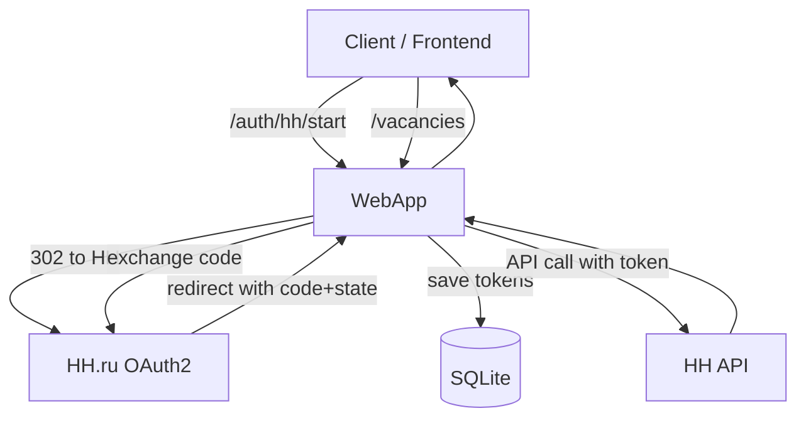
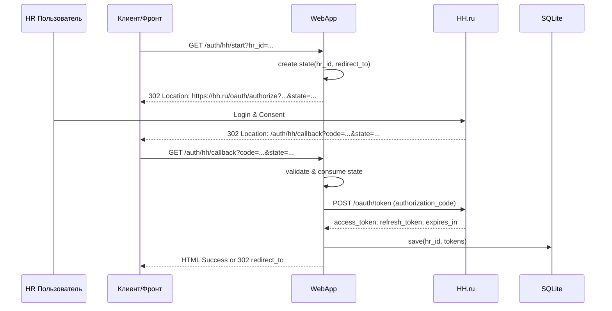

# Компонент: WebApp (FastAPI)

## 1. Обзор

`WebApp` — продакшн‑ориентированный FastAPI сервис, который инкапсулирует внешний контракт OAuth2‑аутентификации с HH.ru и предоставляет API для прикладного функционала (например, чтение вакансий). Компонент предназначен для «атомарного» деплоя per‑школа (один контейнер = одна школа), но спроектирован с учётом multi‑tenant‑готовности (привязка токенов к HR, state‑защита, сериализация refresh).

Основные обязанности:
- Инициировать OAuth2 Authorization Code Flow (`/auth/hh/start`).
- Обрабатывать callback от HH и обменивать `code` на токены (`/auth/hh/callback`).
- Хранить токены per‑HR в SQLite с безопасной моделью доступа.
- Выполнять запросы к HH API от имени HR с авто‑обновлением токена (`/vacancies`).
- Предоставлять унифицированное API для LLM-фич (`/features/{name}/generate`).

## 2. Контракт (роуты)

- `GET /auth/hh/start?hr_id=<str>&redirect_to=<url>`
  - Генерирует одноразовый `state` и делает 302 redirect на `https://hh.ru/oauth/authorize`.
  - Параметры: `response_type=code`, `client_id`, `redirect_uri` (из настроек), `state`.
- `GET /auth/hh/callback?code=<str>&state=<str>`
  - Валидирует/«съедает» `state`, меняет `code`→токены, сохраняет в хранилище.
  - Возвращает HTML «успех» или 302 на `redirect_to` из `state`.
- `GET /vacancies?hr_id=<str>&text=<str>`
  - Поднимает токены HR, выполняет запрос к HH API с авто‑refresh, возвращает JSON.
- **Новые LLM Features роуты:**
  - `GET /features` — список всех доступных LLM-фич
  - `POST /features/{feature_name}/generate` — генерация через любую зарегистрированную фичу
- Технические: `GET /healthz`, `GET /readyz`.

## 3. Архитектура



Компоненты:
- `app.py` — FastAPI приложение (роуты, DI одноразовых сервисов).
- `storage.py` — SQLite‑хранилища: `TokenStorage` и `OAuthStateStore` (с TTL), путь задаётся `WEBAPP_DB_PATH`.
- `service.py` — `PersistentTokenManager` (обёртка над `HHTokenManager`), сериализует refresh через `asyncio.Lock` per‑HR, сохраняет обновлённые токены.
- **`features.py`** — унифицированные роуты для LLM-фич через `FeatureRegistry`.
- Использует `HHSettings`, `HHApiClient`, `HHTokenManager` из `hh_adapter`.
- Использует `FeatureRegistry`, `ILLMGenerator` из `llm_features`.

## 4. Поток аутентификации



## 5. Хранение и конкурентность

- Таблица `tokens` хранит `hr_id`, `access_token`, `refresh_token`, `expires_at`.
- Таблица `oauth_state` хранит одноразовый `state` с TTL (по умолчанию 10 минут).
- Для предотвращения гонок при параллельных запросах одного HR применяется `asyncio.Lock` per‑HR в `PersistentTokenManager` (refresh выполняется ровно один раз).

## 6. Безопасность

- `state` защищает от CSRF и связывает запрос с `hr_id` и `redirect_to`.
- Токены не логируются; рекомендуется хранить `refresh_token` шифрованно при переходе на внешнюю БД.
- HTTPS обеспечивается внешним уровнем (Ingress/Proxy). Секреты — через переменные окружения.

## 7. Конфигурация

Переменные окружения:
- `HH_CLIENT_ID`, `HH_CLIENT_SECRET`, `HH_REDIRECT_URI` — OAuth2 настройки приложения HH.
- `WEBAPP_DB_PATH` — путь к SQLite (по умолчанию `app.sqlite3`).

Пример `.env`:
```dotenv
HH_CLIENT_ID=...
HH_CLIENT_SECRET=...
HH_REDIRECT_URI=http://localhost:8080/auth/hh/callback
WEBAPP_DB_PATH=/data/app.sqlite3
```

## 8. Деплой и Docker

Минимальный сценарий деплоя per‑школа:
- Один контейнер `webapp` с пробросом 8080.
- Том для БД (`/data/app.sqlite3`) через `WEBAPP_DB_PATH`.
- Свой `.env` с HH кредами.

Поток работы в Docker:
1) HR открывает `/auth/hh/start?hr_id=...` на домене школы.
2) После авторизации HH вызывает `/auth/hh/callback` в контейнере школы.
3) Сервис сохраняет токены в volume (`/data/app.sqlite3`).
4) Клиентские запросы к `/vacancies` используют сохранённые токены; при истечении выполняется refresh под локом, и новые токены снова пишутся в БД.

## 9. Тестирование

- Юнит‑тесты адаптера — в `tests/hh_adapter/`.
- Для WebApp рекомендуется добавить интеграционные тесты роутов с `httpx.AsyncClient` (по отдельному запросу).

