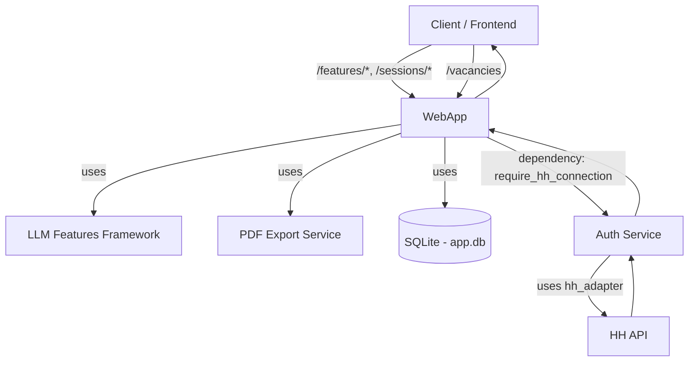

# Компонент: WebApp (FastAPI)

## 1. Обзор

`WebApp` — продакшн‑ориентированный FastAPI сервис, который предоставляет основной API приложения.

Основные обязанности:
- Предоставлять унифицированное API для LLM-фич (`/features/{name}/generate`).
- Предоставлять API для экспорта результатов в PDF (`/features/{feature_name}/export/pdf`).
- Управлять сессиями для работы с документами (резюме и вакансии), чтобы избежать повторной обработки данных.
- Предоставлять API для получения списка вакансий с HH.ru (требует аутентификации).

**Важно:** `WebApp` больше не управляет OAuth2-аутентификацией с HH.ru. Эта логика полностью перенесена в компонент `Auth`. Запросы, требующие доступа к HH.ru, защищены middleware-зависимостью `require_hh_connection` из модуля `auth`.

## 2. Контракт (роуты)

- `GET /vacancies?text=<str>`
  - Возвращает список вакансий с HH.ru.
  - **Требует аутентификации пользователя и подключенного аккаунта HH.ru.** Доступ контролируется через cookie сессии и зависимость `require_hh_connection`.
- **LLM Features роуты:**
  - `GET /features` — список всех доступных LLM-фич.
  - `POST /features/{feature_name}/generate` — генерация через любую зарегистрированную фичу.
    - Тело запроса: либо `{ session_id, options, version? }`, либо `{ resume, vacancy, options, version? }`.
- **PDF Export роуты:**
  - `POST /features/{feature_name}/export/pdf` — генерация PDF отчета для конкретной фичи.
    - Тело запроса: `{ result, metadata? }`.
- **Сессии и персистентность:**
  - `POST /sessions/init_upload` — инициализация сессии из сырого ввода (PDF + vacancy URL).
  - `POST /sessions/init_json` — инициализация сессии из готовых моделей (`ResumeInfo` + `VacancyInfo`).
- Технические: `GET /healthz`, `GET /readyz`.

## 3. Архитектура



Компоненты:
- `app.py` — FastAPI приложение (роуты, DI).
- `features.py` — унифицированные роуты для LLM-фич.
- `pdf.py` — роуты экспорта в PDF.
- `sessions.py` — роуты инициализации сессий.
- `storage_docs.py` — SQLite‑хранилища резюме/вакансий/сессий.
- Зависит от: `auth`, `hh_adapter`, `llm_features`, `pdf_export`.

## 4. Хранение данных (Сессии)

`WebApp` управляет хранением документов (резюме, вакансии) и сессий для их совместного использования в разных LLM-фичах.

- Таблица `resume_docs`: `{ id, user_id, org_id, source_hash, title, data_json, created_at }`
- Таблица `vacancy_docs`: `{ id, user_id, org_id, source_url, source_hash, name, data_json, created_at }`
- Таблица `sessions`: `{ id, user_id, org_id, resume_id, vacancy_id, created_at, expires_at? }`

Контекст пользователя (`user_id`, `org_id`) получается из cookie-сессии, управляемой модулем `Auth`. Параметр `hr_id` больше не используется.

Диаграмма работы с сессиями:


## 5. Безопасность

- Доступ к эндпоинтам, работающим с данными пользователя, контролируется через cookie-сессии модуля `Auth`.
- HTTPS обеспечивается внешним уровнем (Ingress/Proxy). Секреты — через переменные окружения.

## 6. Конфигурация

- `WEBAPP_DB_PATH` — путь к SQLite (по умолчанию `app.sqlite3`).
- Остальные настройки, связанные с HH.ru, теперь находятся в ведении модуля `Auth`.

## 7. Примеры вызовов

**Важно:** Все примеры предполагают, что пользователь уже залогинен (т.е. в запросе передается cookie `sid`).

Инициализация сессии:
```bash
curl -X POST http://localhost:8080/sessions/init_upload \
  -b cookies.txt \
  -F vacancy_url=https://hh.ru/vacancy/123456 \
  -F "resume_file=@tests/data/resume.pdf;type=application/pdf"
```

Запуск фичи по session_id:
```bash
curl -X POST http://localhost:8080/features/gap_analyzer/generate \
  -b cookies.txt \
  -H "Content-Type: application/json" \
  -d '{"session_id":"<uuid>", "options":{"temperature":0.2}}'
```

```
