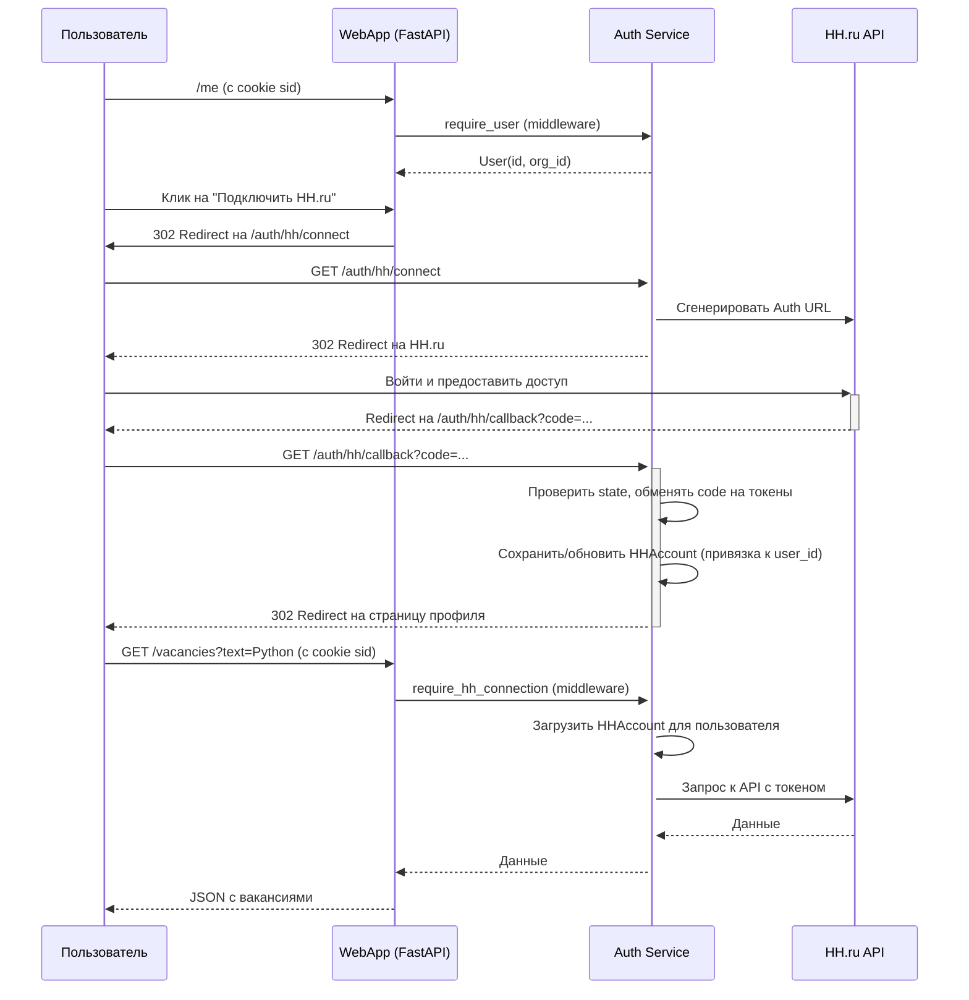
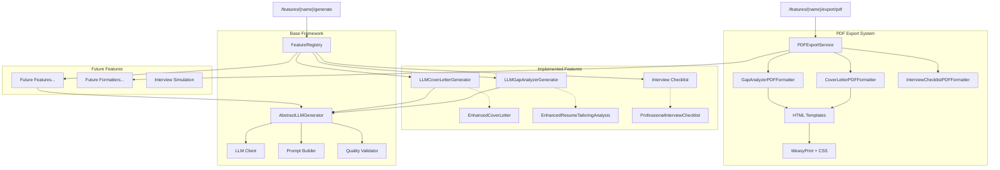
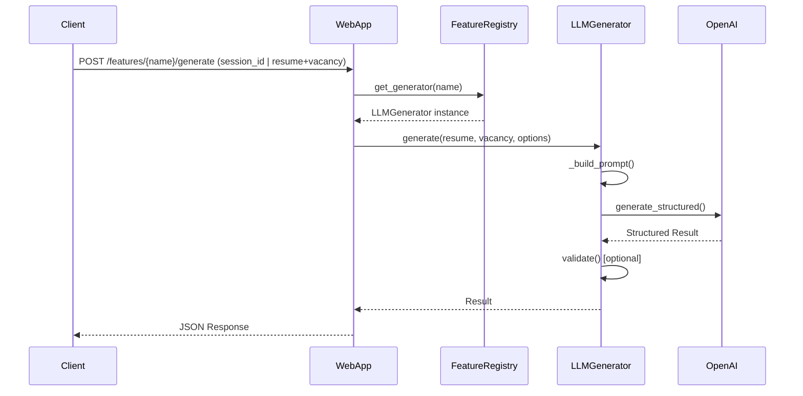
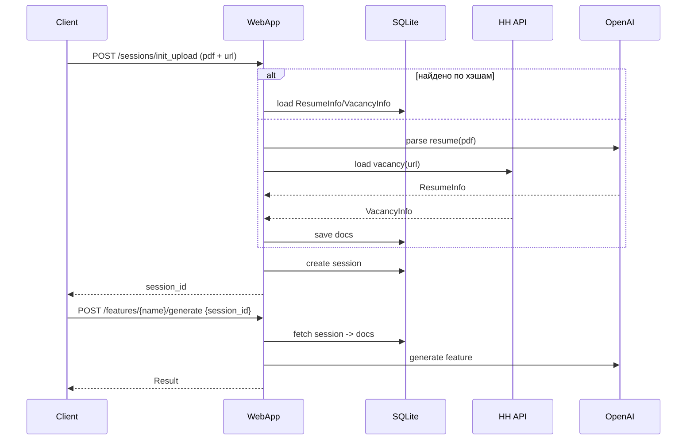

# Обзор архитектуры

В этом документе представлен высокоуровневый обзор архитектуры системы, включая основные компоненты и процесс аутентификации.

## Компоненты

Система состоит из нескольких компонентов и одного веб‑сервиса:

- **Frontend (`frontend/`):** React+TypeScript веб-приложение с современным интерфейсом для авторизации пользователей. Предоставляет формы входа и регистрации с валидацией, интегрируется с Auth Service через HTTP API и cookie-based sessions. Использует Tailwind CSS для стилизации и Vite для сборки. Включает comprehensive тестовое покрытие с Vitest и React Testing Library.

- **Callback Server (`src/callback_server`):** Легковесный сервер на FastAPI, отвечающий за одну задачу: перехват `authorization_code` в процессе OAuth2. Он запускается, ожидает перенаправления пользователя от провайдера аутентификации, сохраняет код во временный файл и завершает работу. Используется для локальных демонстраций.

- **WebApp (`src/webapp`):** Продакшн‑ориентированный FastAPI сервис, который предоставляет API для LLM-фич, экспорта в PDF и управления сессиями (`ResumeInfo`/`VacancyInfo`). Включает CORS middleware для интеграции с Frontend. Непосредственно аутентификацией и управлением токенами HH не занимается.

- **Auth (`src/auth`):** Модуль аутентификации и управления пользователями. Отвечает за:
  - Регистрацию и вход (email+пароль).
  - Управление сессиями через cookie (`sid`).
  - **Интеграцию с HH.ru OAuth2**: предоставляет эндпоинты `/auth/hh/connect`, `/auth/hh/callback`, `/auth/hh/status` и управляет жизненным циклом токенов HH, привязывая их к аккаунту пользователя (`user_id`, `org_id`). Для этого использует `HHAccountService`.

- **HH Adapter (`src/hh_adapter`):** Клиент для API HH.ru. Используется сервисом `Auth` для выполнения OAuth2 флоу и последующих запросов к API HH. Напрямую из `WebApp` не вызывается.

- **Parsing (`src/parsing`):** Библиотечный модуль без собственного сервиса. Решает две задачи: извлечение информации из резюме (PDF → LLM → `ResumeInfo`) и преобразование вакансий из HH JSON в `VacancyInfo`. Подробности и диаграммы см. в `docs/architecture/components/parser.md`.
 
- **LLM Features Framework (`src/llm_features`):** Модульная архитектура для LLM-фич с автоматической регистрацией, версионированием и унифицированным API. Включает базовые классы (`AbstractLLMGenerator`), систему регистрации (`FeatureRegistry`) и универсальные роуты (`/features/{name}/generate`). Подробности: `src/llm_features/README.md`.

- **LLM Cover Letter (`src/llm_cover_letter`):** Первая фича в новой архитектуре. Генерация персонализированных сопроводительных писем из `ResumeInfo` и `VacancyInfo` с использованием LLM и версионируемой системы промптов. См. `docs/architecture/components/llm_cover_letter.md`.

- **LLM Gap Analyzer (`src/llm_gap_analyzer`):** Вторая фича в LLM Features Framework. Детальный GAP-анализ соответствия резюме вакансии с использованием профессиональной HR методологии (6 этапов: скрининг, анализ требований, оценка качества, рекомендации). Генерирует структурированный анализ с процентом соответствия и рекомендацией по найму. Поддерживает PDF экспорт. См. `docs/architecture/components/llm_gap_analyzer.md`.

- **PDF Export (`src/pdf_export`):** Модульная система экспорта результатов LLM-фич в PDF формат. Использует WeasyPrint + Jinja2 для рендеринга HTML шаблонов с профессиональными CSS стилями. Поддерживает все зарегистрированные фичи через систему форматтеров. Интегрирован с WebApp API. См. `docs/architecture/components/pdf_export.md`.

- **LLM Interview Checklist (`src/llm_interview_checklist`):** Третья фича. Генерация профессионального чек-листа подготовки к интервью (технический/поведенческий блоки, исследование компании, приоритеты, ресурсы, критерии успеха). Доступна через универсальное API (`/features/interview_checklist/generate`), поддерживает версионирование и экспорт в PDF.

- **LLM Interview Simulation (`src/llm_interview_simulation`):** Четвёртая фича. Полноценная симуляция интервью между AI HR-менеджером и AI кандидатом на основе реального резюме и вакансии. Адаптивные вопросы под уровень кандидата (junior/middle/senior/lead), многораундовый диалог, покрытие различных типов вопросов (технические, поведенческие, мотивационные), полный трейсинг и профессиональный PDF экспорт. Доступна через API (`/features/interview_simulation/generate`) и CLI. См. `docs/architecture/components/llm_interview_simulation.md`.

- **CLI (`src/cli`):** Консольный интерфейс для взаимодействия с WebApp API. Обеспечивает полный доступ к функционалу системы через командную строку с персистентной аутентификацией (session cookies), загрузкой документов, генерацией всех LLM-фич и конфигурируемыми опциями. Включает специальные конфигурации для симуляции интервью с детальными настройками сложности, стиля HR и типов вопросов.

## Процесс аутентификации

Диаграмма ниже иллюстрирует процесс HH OAuth (подключение провайдера). Для входа в приложение используется `src/auth` (cookie‑сессии), что отделено от HH OAuth.

## LLM Features Architecture

Новая модульная архитектура для LLM-функций обеспечивает легкое добавление и удаление фич:

### Процесс использования LLM фич

### Сессии и персистентность

Добавлена лёгкая подсистема сессий для одного «первого касания», после которого все фичи вызываются только с `session_id`:

