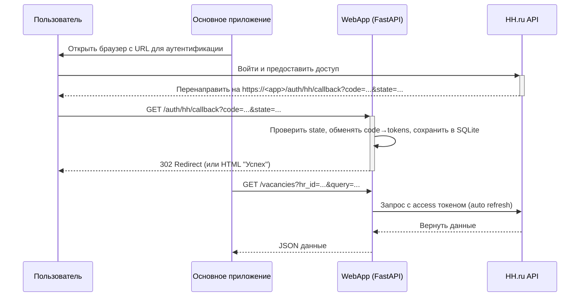
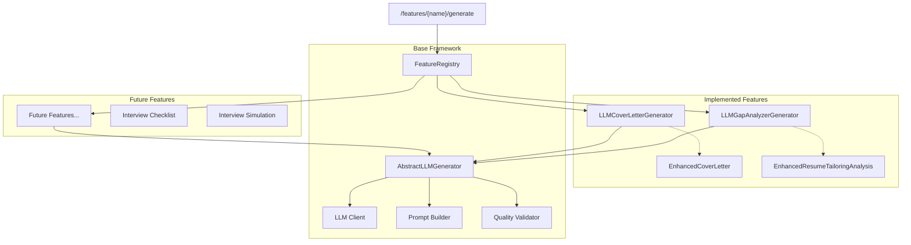
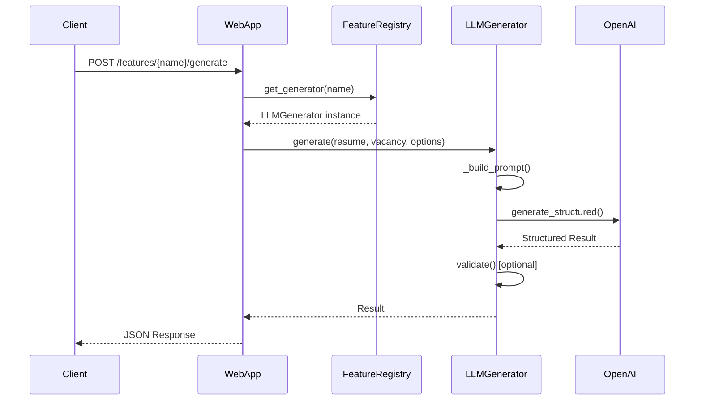

# Обзор архитектуры

В этом документе представлен высокоуровневый обзор архитектуры системы, включая основные компоненты и процесс аутентификации.

## Компоненты

Система состоит из нескольких компонентов и одного веб‑сервиса:

- **Callback Server (`src/callback_server`):** Легковесный сервер на FastAPI, отвечающий за одну задачу: перехват `authorization_code` в процессе OAuth2. Он запускается, ожидает перенаправления пользователя от провайдера аутентификации, сохраняет код во временный файл и завершает работу. Используется для локальных демонстраций.

- **WebApp (`src/webapp`):** Продакшн‑ориентированный FastAPI сервис с роутами `/auth/hh/start`, `/auth/hh/callback`, `/vacancies`. Хранит токены в SQLite (пер‑школа контейнер), обеспечивает защиту `state` и сериализацию обновлений токена для многопользовательского сценария (пер‑HR).

- **HH Adapter (`src/hh_adapter`):** Комплексный клиент для API HH.ru. Он управляет токенами (обмен кода на токены, их автоматическое обновление) и предоставляет чистый интерфейс для выполнения запросов к API.

- **Parsing (`src/parsing`):** Библиотечный модуль без собственного сервиса. Решает две задачи: извлечение информации из резюме (PDF → LLM → `ResumeInfo`) и преобразование вакансий из HH JSON в `VacancyInfo`. Подробности и диаграммы см. в `docs/architecture/components/parser.md`.
 
- **LLM Features Framework (`src/llm_features`):** Модульная архитектура для LLM-фич с автоматической регистрацией, версионированием и унифицированным API. Включает базовые классы (`AbstractLLMGenerator`), систему регистрации (`FeatureRegistry`) и универсальные роуты (`/features/{name}/generate`). Подробности: `src/llm_features/README.md`.

- **LLM Cover Letter (`src/llm_cover_letter`):** Первая фича в новой архитектуре. Генерация персонализированных сопроводительных писем из `ResumeInfo` и `VacancyInfo` с использованием LLM и версионируемой системы промптов. См. `docs/architecture/components/llm_cover_letter.md`.

- **LLM Gap Analyzer (`src/llm_gap_analyzer`):** Вторая фича в LLM Features Framework. Детальный GAP-анализ соответствия резюме вакансии с использованием профессиональной HR методологии (6 этапов: скрининг, анализ требований, оценка качества, рекомендации). Генерирует структурированный анализ с процентом соответствия и рекомендацией по найму. См. `docs/architecture/components/llm_gap_analyzer.md`.

## Процесс аутентификации

Диаграмма ниже иллюстрирует полный процесс аутентификации через WebApp:

## LLM Features Architecture

Новая модульная архитектура для LLM-функций обеспечивает легкое добавление и удаление фич:

### Процесс использования LLM фич:

