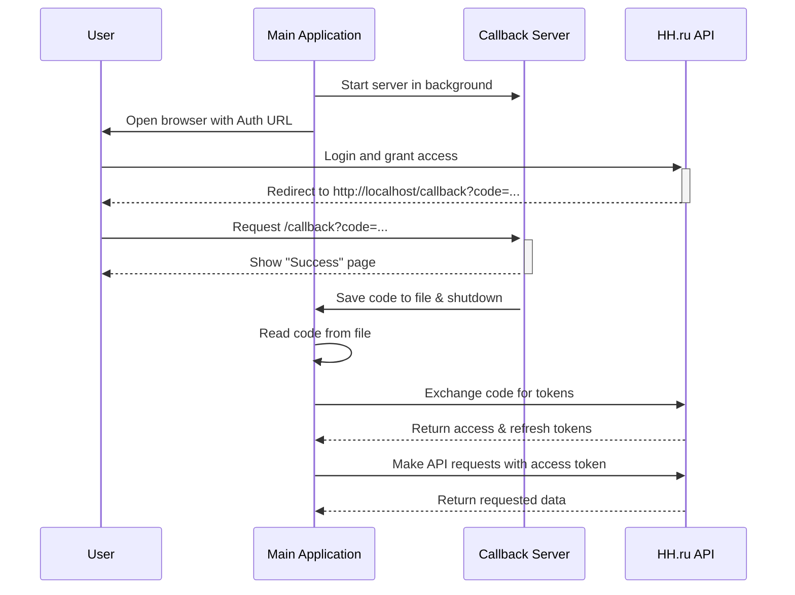

# Architecture Overview

This document provides a high-level overview of the system architecture, including the main components and the authentication flow.

## Components

The system consists of two main components:

-   **Callback Server (`src/callback_server`):** A lightweight FastAPI server responsible for a single task: capturing the `authorization_code` during the OAuth2 flow. It starts up, waits for the user to be redirected from the authentication provider, saves the code to a temporary file, and shuts down.

-   **HH Adapter (`src/hh_adapter`):** A comprehensive client for the HH.ru API. It handles token management (exchanging the code for tokens, refreshing them automatically) and provides a clean interface for making API requests.

## Authentication Flow

The diagram below illustrates the complete authentication process:

