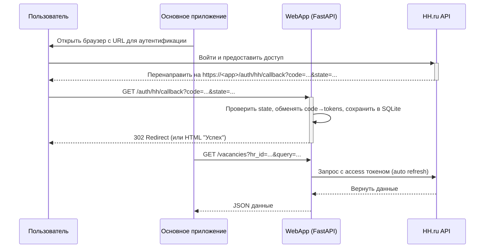

# Обзор архитектуры

В этом документе представлен высокоуровневый обзор архитектуры системы, включая основные компоненты и процесс аутентификации.

## Компоненты

Система состоит из двух основных компонентов (и одного веб‑сервиса):

- **Callback Server (`src/callback_server`):** Легковесный сервер на FastAPI, отвечающий за одну задачу: перехват `authorization_code` в процессе OAuth2. Он запускается, ожидает перенаправления пользователя от провайдера аутентификации, сохраняет код во временный файл и завершает работу. Используется для локальных демонстраций.

- **WebApp (`src/webapp`):** Продакшн‑ориентированный FastAPI сервис с роутами `/auth/hh/start`, `/auth/hh/callback`, `/vacancies`. Хранит токены в SQLite (пер‑школа контейнер), обеспечивает защиту `state` и сериализацию обновлений токена для многопользовательского сценария (пер‑HR).

- **HH Adapter (`src/hh_adapter`):** Комплексный клиент для API HH.ru. Он управляет токенами (обмен кода на токены, их автоматическое обновление) и предоставляет чистый интерфейс для выполнения запросов к API.

## Процесс аутентификации

Диаграмма ниже иллюстрирует полный процесс аутентификации через WebApp:

