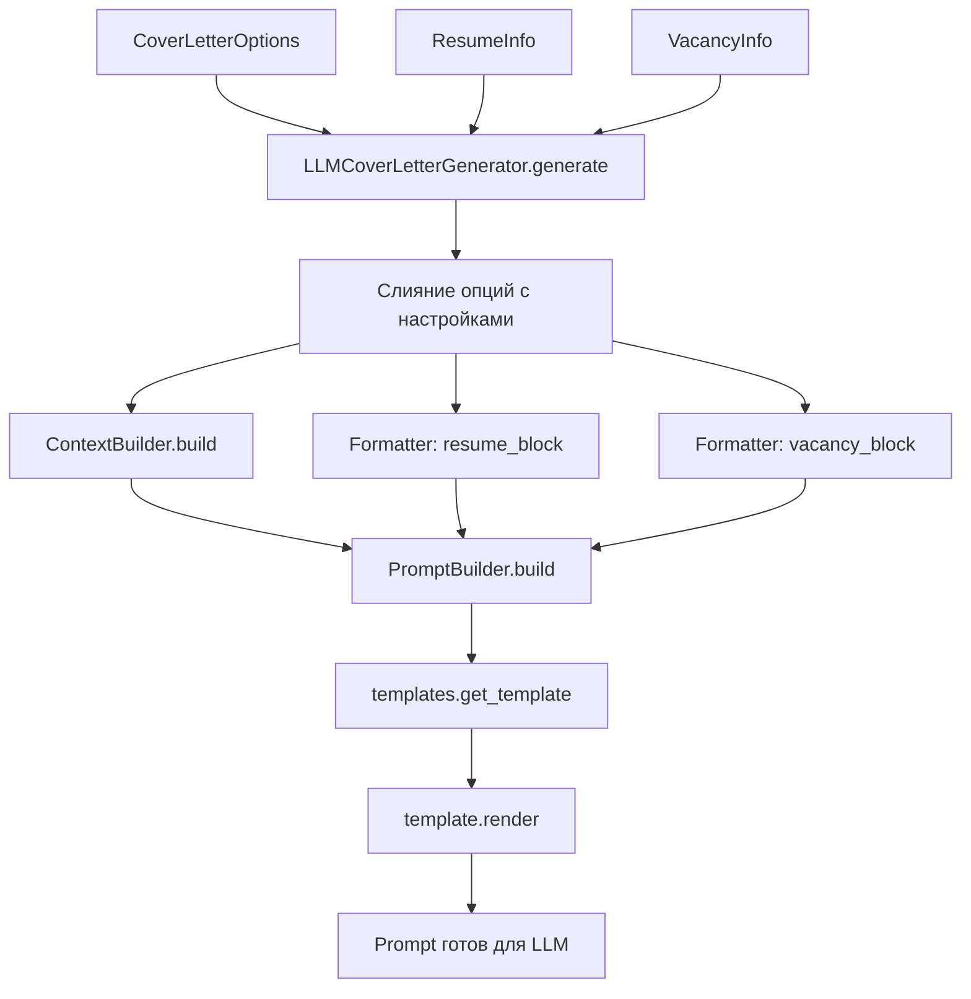

# Prompts System — Детальное руководство

Полное описание процесса сборки промпта для генерации сопроводительных писем.

## 📋 Поток сборки промпта



## 🔧 Детальный разбор этапов

### 1. Слияние настроек (service.py:82-90)

Приоритет переменных:
1. **Параметры пользователя** (`options`) — высший приоритет
2. **Настройки из .env** (`LLMCoverLetterSettings`) — дефолты
3. **Хардкод** — fallback значения

```python
# Результат слияния CoverLetterOptions + LLMCoverLetterSettings
opts = CoverLetterOptions(
    language="ru",                    # из settings.language (COVER_LETTER_LANGUAGE)
    prompt_version="cover_letter.v1", # из settings.prompt_version (COVER_LETTER_PROMPT_VERSION)
    temperature=0.4,                  # из settings.temperature (COVER_LETTER_TEMPERATURE)
    quality_checks=False,             # из settings.quality_checks (COVER_LETTER_QUALITY_CHECKS)
    # + любые переданные пользователем опции переопределяют выше
)
```

### 2. Построение контекста (builders.py:36-64)

`DefaultContextBuilder.build()` анализирует входные данные:

**Источники переменных:**

| Переменная | Источник | Логика |
|------------|----------|--------|
| `company_size` | `VacancyInfo.description` | **Авто-детекция по ключевым словам:**<br/>• "стартап", "startup" → `STARTUP`<br/>• "корпорация", "холдинг" → `ENTERPRISE`<br/>• "международная", "global" → `LARGE`<br/>• иначе → `MEDIUM` |
| `company_name` | `VacancyInfo.company_name` | Прямое копирование |
| `position_title` | `VacancyInfo.name` | Прямое копирование |
| `language` | `CoverLetterOptions.language` | Из настроек/опций |
| `length` | `CoverLetterOptions.length` | Из настроек/опций |
| `role_hint` | `CoverLetterOptions.role_hint` + `ResumeInfo.title` | **Авто-детекция если не задано:**<br/>1. Берется `options.role_hint`<br/>2. Если None → анализ `resume.title`<br/>3. По ключевым словам → `RoleType` |
| `company_tone_instruction` | `company_size` → `mappings.py` | **Динамический блок из маппинга** |
| `role_adaptation_instruction` | `effective_role_hint` → `mappings.py` | **Динамический блок из маппинга** |

**Пример результата (до динамических блоков):**
```python
{
    "company_size": "STARTUP",           # детектировано из описания
    "company_name": "TechCorp",          # из vacancy.company_name
    "position_title": "Senior Python Developer", # из vacancy.name
    "language": "ru",                    # из options
    "length": "MEDIUM",                  # из options
    "role_hint": "DEVELOPER",            # авто-детекция из resume.title="Python Developer"
    # Новые динамические блоки:
    "company_tone_instruction": "более неформально, энтузиазм, готовность к вызовам...",
    "role_adaptation_instruction": "**DEVELOPER**: Фокусируйтесь на техническом стеке, проектах..."
}
```

### 3. Форматирование блоков (formatter.py)

**Резюме → resume_block:**
```
## Профиль кандидата
**ФИО:** Иван Иванов Иванович
**Общий опыт работы:** 5 лет 3 мес.

### Профессиональная специализация
**Желаемая должность:** Python Developer

### Профессиональные компетенции
Backend разработка на Python, Django, FastAPI

### Технические навыки и технологии
- Python
- Django
- PostgreSQL
- Docker

### Опыт и достижения
1. Senior Python Developer | Компания ABC (2020-01 - по наст.)
Разработка микросервисной архитектуры...
```

**Вакансия → vacancy_block:**
```
## Вакансия
**Позиция:** Senior Python Developer
**Компания:** TechCorp

### Профессиональные роли
- Backend Developer

### Описание
Ищем опытного Python разработчика для работы в стартапе...

### Ключевые навыки
- Python
- FastAPI
- Microservices
```

### 4. Обработка extra_context (builders.py)

**Случай 1 — словарь:**
```python
options.extra_context = {"deadline": "срочно", "remote": "полная удаленка"}
# Результат:
"- deadline: срочно\n- remote: полный удаленка"
```

**Случай 2 — пустой словарь:**
```python
options.extra_context = {} или None
# Результат:
"(нет)"
```

**Случай 3 — строка (передается как есть):**
```python
options.extra_context = "Готов к переезду в Москву"
# Результат:
"Готов к переезду в Москву"
```

### 5. Сборка финального промпта (builders.py)

`DefaultPromptBuilder.build()` объединяет всё:

**Переменные для подстановки:**
```python
context = {
    # Из ContextBuilder:
    "company_size": "STARTUP",
    "company_name": "TechCorp", 
    "position_title": "Senior Python Developer",
    "language": "ru",
    "length": "MEDIUM",
    "role_hint": "DEVELOPER",
    "company_tone_instruction": "более неформально, энтузиазм, готовность к вызовам...",
    "role_adaptation_instruction": "**DEVELOPER**: Фокусируйтесь на техническом стеке, проектах...",
    
    # Из Formatter:
    "resume_block": "## Профиль кандидата\n**ФИО:** ...",
    "vacancy_block": "## Вакансия\n**Позиция:** ...",
    "extra_context_block": "- deadline: срочно\n- remote: полный удаленка"
}
```

**Финальный System prompt (v1):**
```
Ты — эксперт по написанию персонализированных сопроводительных писем в IT.
Учитывай контекст компании и позиции. Пиши на языке: ru.

## КОНТЕКСТ КОМПАНИИ
Размер компании: STARTUP; Компания: TechCorp; Позиция: Senior Python Developer.
Желаемая длина: MEDIUM.

## ТОНАЛЬНОСТЬ
более неформально, энтузиазм, готовность к вызовам...

## АДАПТАЦИЯ ПО РОЛИ
**DEVELOPER**: Фокусируйтесь на техническом стеке, проектах...
```

**Финальный System prompt (v2):**
```
Ты — эксперт по написанию персонализированных сопроводительных писем в IT.
Создавай профессиональные письма, адаптированные под контекст компании и роли.

## КОНТЕКСТ ЗАДАЧИ
Язык письма: ru
Компания: TechCorp (размер: STARTUP)
Позиция: Senior Python Developer
Желаемая длина: MEDIUM

## ТОНАЛЬНОСТЬ И СТИЛЬ
более неформально, энтузиазм, готовность к вызовам...

## СПЕЦИАЛИЗАЦИЯ И ФОКУС
**DEVELOPER**: Фокусируйтесь на техническом стеке, проектах...

## ТРЕБОВАНИЯ К КАЧЕСТВУ
- Максимальная персонализация под компанию и роль
- Конкретные примеры из опыта, релевантные позиции
- Избегай общих фраз и шаблонности
- Фокусируйся на ценности для работодателя
- Учитывай размер компании в формулировках
```

**Финальный User prompt:**
```
## Данные

### Резюме:
<resume_start>
## Профиль кандидата
**ФИО:** Иван Иванов Иванович
**Общий опыт работы:** 5 лет 3 мес.
...
</resume_end>

### Вакансия:
<vacancy_start>
## Вакансия
**Позиция:** Senior Python Developer
**Компания:** TechCorp
...
</vacancy_start>

### Доп. контекст:
- deadline: срочно
- remote: полный удаленка

Сгенерируй JSON согласно схеме EnhancedCoverLetter.
```

## ⚙️ Настройки через переменные окружения

```bash
# .env
COVER_LETTER_PROMPT_VERSION=cover_letter.v1    # Версия шаблона
COVER_LETTER_TEMPERATURE=0.4                   # Температура LLM
COVER_LETTER_QUALITY_CHECKS=false             # Включить валидацию
COVER_LETTER_LANGUAGE=ru                       # Язык письма
COVER_LETTER_MODEL_NAME=gpt-4o-mini           # Переопределить модель LLM
```

## 🔄 Точки расширения

1. **Новая версия промпта:**
   ```python
   # В templates.py
   if version == "cover_letter.v2":
       return PromptTemplate(...)
   ```

2. **Новые переменные контекста:**
   ```python
   # В DefaultContextBuilder.build()
   ctx["my_variable"] = analyze_something(vacancy)
   ```

3. **Кастомная детекция company_size:**
   ```python
   class MyContextBuilder(IContextBuilder):
       def build(self, resume, vacancy, options):
           # Своя логика
   ```

4. **Новый формат блоков:**
   ```python
   # Переопределить format_resume_for_cover_letter()
   ```

## 🎯 Динамические промпты в действии

### Автоопределение роли

```python
# Примеры автоопределения из названия должности
detect_role_from_title("Senior Python Developer")     # → RoleType.DEVELOPER
detect_role_from_title("ML Engineer")                 # → RoleType.ML_ENGINEER  
detect_role_from_title("QA Automation Engineer")      # → RoleType.QA_ENGINEER
detect_role_from_title("Team Lead Backend")           # → RoleType.MANAGER
detect_role_from_title("DevOps Engineer")             # → RoleType.DEVOPS
```

### Пример финального промпта для STARTUP + DEVELOPER

**System Prompt (cover_letter.v2):**
```
Ты — эксперт по написанию персонализированных сопроводительных писем в IT.
Создавай профессиональные письма, адаптированные под контекст компании и роли.

## КОНТЕКСТ ЗАДАЧИ
Язык письма: ru
Компания: TechStartup (размер: STARTUP)
Позиция: Senior Python Developer
Желаемая длина: MEDIUM

## ТОНАЛЬНОСТЬ И СТИЛЬ
более неформально, энтузиазм, готовность к вызовам. Подчеркивай адаптивность, 
готовность к быстрым изменениям, стремление влиять на продукт с первых дней.

## СПЕЦИАЛИЗАЦИЯ И ФОКУС
**DEVELOPER**: Фокусируйтесь на техническом стеке, проектах, производительности, 
code review, архитектуре. Упоминайте конкретные технологии, паттерны проектирования, 
оптимизации кода.

## ТРЕБОВАНИЯ К КАЧЕСТВУ
- Максимальная персонализация под компанию и роль
- Конкретные примеры из опыта, релевантные позиции
- Избегай общих фраз и шаблонности
- Фокусируйся на ценности для работодателя
- Учитывай размер компании в формулировках
```

### Пример финального промпта для ENTERPRISE + DATA_SCIENTIST

**System Prompt (cover_letter.v2):**
```
## ТОНАЛЬНОСТЬ И СТИЛЬ
максимально профессионально, стабильность. Подчеркивай надежность, 
соответствие стандартам, опыт работы с комплаенсом и корпоративными процедурами.

## СПЕЦИАЛИЗАЦИЯ И ФОКУС  
**DATA_SCIENTIST**: Фокусируйтесь на исследованиях, статистике, инсайтах, 
A/B тестах, бизнес-метриках. Подчеркивайте влияние анализа на бизнес-решения, 
работу с большими данными.
```

### Переключение версий

```bash
# Использовать базовую версию v1
COVER_LETTER_PROMPT_VERSION=cover_letter.v1

# Использовать улучшенную версию v2 с динамическими блоками
COVER_LETTER_PROMPT_VERSION=cover_letter.v2
```

## 📊 Маппинги

### Тональность по размеру компании

- **STARTUP**: неформально, энтузиазм, быстрые изменения
- **MEDIUM/LARGE**: баланс профессионализма и человечности  
- **ENTERPRISE**: максимально профессионально, стандарты, процессы

### Адаптация по типам ролей

- **DEVELOPER**: технический стек, архитектура, код
- **ML_ENGINEER**: алгоритмы, модели, пайплайны
- **DATA_SCIENTIST**: исследования, статистика, инсайты
- **QA_ENGINEER**: качество, баги, тестирование
- **DEVOPS**: автоматизация, инфраструктура, надежность
- **DESIGNER**: UX-метрики, портфолио, конверсия
- **MANAGER**: команда, процессы, лидерство
